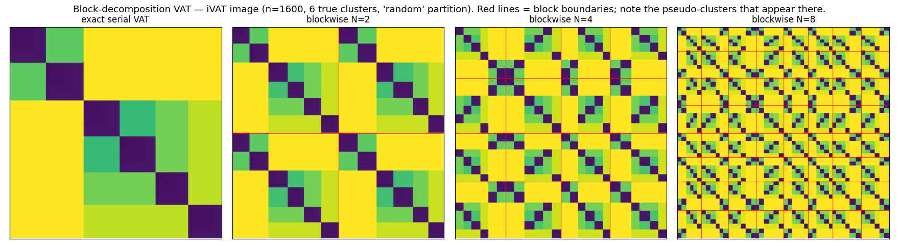
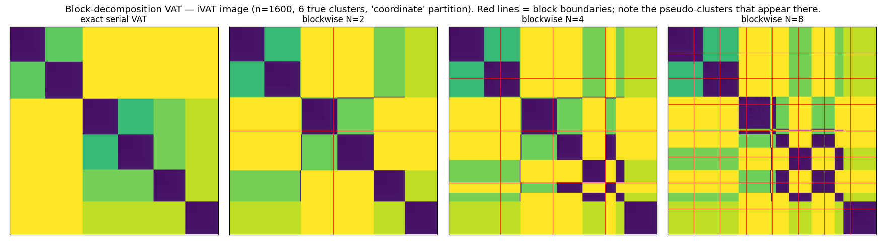

# Spike: block-decomposition ("divide-and-conquer") VAT — findings

**Idea.** Partition the n points into N groups, extract each group's within-group
dissimilarity sub-matrix D₁…D_N, run VAT on each **independently**, and merge
(concatenate) the sub-orderings. Sub-VAT is O((n/N)²), so total MST/iVAT work
drops ~N× and the N blocks are embarrassingly parallel; if you also only compute
the within-block distances, the O(n²) distance build drops ~N× too.

**The artifact (confirmed).** Within-group VAT never interleaves points across
groups, so every group becomes a contiguous run in the merged order → a dark
diagonal block. **Pseudo-clusters appear at the partition boundaries.** Severity
depends entirely on whether the partition respects cluster structure.

## Images

Exact serial VAT vs blockwise N=2/4/8 (red lines = block boundaries).

**Random partition — catastrophic:** each block contains a mix of all clusters,
so the merged image *repeats the whole cluster set N times* and loses all
cross-block structure (off-diagonals saturate).

**Coordinate (spatially-coherent) partition — tolerable:** blocks mostly contain
whole clusters; the exact structure is largely preserved, with extra
subdivisions only where a true cluster straddles a boundary.

## Quality vs N (n=4000, k=10; ideal label-runs = 10, ARI=1.0 is exact)

| partition | N | label-runs (ideal 10) | ARI vs truth |
|-----------|---|-----------------------|--------------|
| exact serial | – | 10 | 1.000 |
| random | 2 | 20 | 0.410 |
| random | 4 | 40 | 0.103 |
| random | 8 | 80 | 0.015 |
| coordinate | 2 | 13 | 0.733 |
| coordinate | 4 | 16 | 0.713 |
| coordinate | 8 | 18 | 0.660 |

- **Random** partition: label-runs = N×k exactly (each block reproduces all k
  clusters) and ARI collapses toward 0 — **unusable**.
- **Coordinate** partition: label-runs grow slowly (10→18) and ARI degrades
  gently (1.0→0.66); the error is localized to clusters cut by a boundary.

## Performance vs N (MST+iVAT stage; distances assumed precomputed)

`max block` = ideal parallel wall-time (one block per core); `work_speedup` =
exact ÷ max-block.

| n | exact ms | N | Σ blocks ms | max block ms | speedup (parallel) |
|-----|---------|---|-------------|--------------|--------------------|
| 4000 | 96 | 2 | 74 | 37 | 2.6× |
| 4000 | 96 | 4 | 46 | 12 | 8.1× |
| 4000 | 96 | 8 | 28 | 4.5 | 21.4× |
| 8000 | 376 | 2 | 309 | 156 | 2.4× |
| 8000 | 376 | 4 | 186 | 47 | 8.1× |
| 8000 | 376 | 8 | 121 | 15 | 24.4× |
| 16000 | 1375 | 2 | 1157 | 584 | 2.4× |
| 16000 | 1375 | 4 | 774 | 215 | 6.4× |
| 16000 | 1375 | 8 | 483 | 61 | 22.5× |

The parallel speedup is **≈ N²**, not N: the largest block is O((n/N)²), so with
N blocks running concurrently the wall-time scales as O(n²/N²). Even the serial
sum-of-blocks (total work) is ~N× less. This is the appeal — a big, cheap,
parallel speedup.

## Verdict

A genuine **speed-for-accuracy** trade, and the accuracy is dominated by the
**partition**:

- **With a structure-blind partition (random): useless** — ARI → 0; the block
  seams manufacture N×k pseudo-clusters.
- **With a structure-aware partition (spatial/coordinate): a usable
  approximation** — up to ~22× parallel speedup at N=8 while keeping ARI ~0.66,
  with the error confined to clusters straddling boundaries.

The boundary pseudo-cluster is **fundamental** to independent-block VAT: without
any cross-block edges, the merge cannot interleave, so seams always read as
cluster edges. A merge that *does* consider cross-block edges to stitch blocks
is exactly a parallel-MST merge — i.e. it converges toward the exact
**Borůvka-VAT** approach (see `experiments/BORUVKA_VAT_FINDINGS.md`), which keeps
the O(n²) work but is exact and ~5× on GPU. So the two ideas bracket the
tradeoff: **block-decomposition = approximate, ~N² parallel, seam artifacts;
Borůvka = exact, ~N-ish parallel, no artifacts.**

Practical takeaway: if pursued, (a) never use a random partition — use a cheap
structure-aware one (spatial sort, a coarse k-means, or a canopy/pre-cluster),
and (b) treat block boundaries as suspect and, ideally, add a light cross-block
stitching pass (the point at which it becomes Borůvka).

## Novelty (literature review, 2026-07-11)

**Verdict: incremental — novel as a *named VAT variant*, but not as an
algorithmic idea, and not defensible as exact.** No published paper does exactly
"split D into within-group diagonal blocks, run VAT/iVAT independently per block,
concatenate the sub-orderings, accept boundary pseudo-clusters." But that is a
*naive* instance of **domain-decomposition MST / single-linkage clustering**, a
well-published family — and every rigorous member of it merges by **recomputing
the cheapest cross-partition edges** so the result stays exact. Dropping those
cross-block dissimilarities (the whole speedup) is exactly what creates the seam
artifact. So: frame it as a **fast *approximate* VAT heuristic**, not a new exact
algorithm.

**The two distinctions to make explicitly:**
- **vs clusiVAT / sVAT / bigVAT (sampling):** those pick m ≪ N MaxiMin
  representatives, build one m×m matrix, VAT it once, and **extend** labels to
  the rest by nearest-prototype — one ordering, cross-cluster geometry preserved
  by spread-out samples. Block-decomposition instead **subdivides all N points**
  into groups, VATs each, and **concatenates** — discarding all inter-block
  dissimilarities. *clusiVAT sub-samples and extends; this sub-divides and
  concatenates.* Different approximation family.
- **vs eVAT (Meng & Yuan 2018, GPU):** eVAT is **exact** parallel VAT (one global
  MST, replicates the identical image). Parallel VAT ≠ partition-VAT-merge.

**The seam artifact is a known phenomenon** (just not named for VAT): NASA's
recursive-segmentation "**processing-window artifacts**" (Tilton, *split-remerge*)
is the same failure — independent windows produce spurious region boundaries at
window edges, fixed by re-merging across the seam. Exact distributed single-
linkage/MST (**DiSC**, **SHRINK/PINK**, distance-decomposition EMST) all treat
cross-partition edges as mandatory *precisely to avoid* this — which is why a
correct cross-block stitch turns this method into Borůvka-VAT.

Selected prior art (see also `docs/bibliography.md`):
- eVAT — Meng & Yuan 2018, *IJDSA* — https://doi.org/10.1007/s41060-018-0100-7 (exact parallel VAT)
- clusiVAT — Kumar et al. 2016, *IEEE T-Cybernetics* 46(10) — https://ieeexplore.ieee.org/document/7302005 (sampling, not partition)
- sVAT — Hathaway et al. 2006, *Pattern Recognition* — https://doi.org/10.1016/j.patcog.2006.02.011
- bigVAT — Huband et al. 2005, *Pattern Recognition* — https://doi.org/10.1016/j.patcog.2005.03.018
- DiSC (distributed single-linkage, MapReduce) — Jin et al. — https://www.researchgate.net/publication/260564139 (exact cross-partition merge)
- SHRINK/PINK (parallel single-linkage) — Hendrix et al. — https://www.researchgate.net/publication/261451376
- Distributed EMST/SL via distance decomposition — 2024 — https://arxiv.org/abs/2406.01739
- Optimal parallel dendrogram / single-linkage (SLD-Merge) — SPAA 2024 — https://dl.acm.org/doi/10.1145/3626183.3659973
- Processing-window artifact + split-remerge — Tilton (NASA) — https://ntrs.nasa.gov/citations/20100028387 · US Patent 7,697,759
- Seriation/matrix-reordering survey — Liiv 2010 — https://doi.org/10.1002/sam.10071

**Honesty flags:** (1) the "pVAT / same image, orders-of-magnitude faster" claim
is a conflation of eVAT (exact) and/or the repo author's own NAFIPS work — not
external prior art for partition-merge. (2) The IJARCS "Parallel Approach of
Visual Access Tendency" (2018) is a low-quality machine-translated paper
describing a reVAT-profile approach, **not** block-merge — do not lean on it.
(3) A broad novelty claim is not defensible; a "fast approximate VAT, with the
seam artifact accepted for O(n²/N) work" framing is.

## Files
- `experiments/blockwise_vat.py` — partitioners, blockwise VAT + merge, metrics,
  figures.
- `experiments/figures/blockwise_vat_quality_{random,coordinate}.png`.
