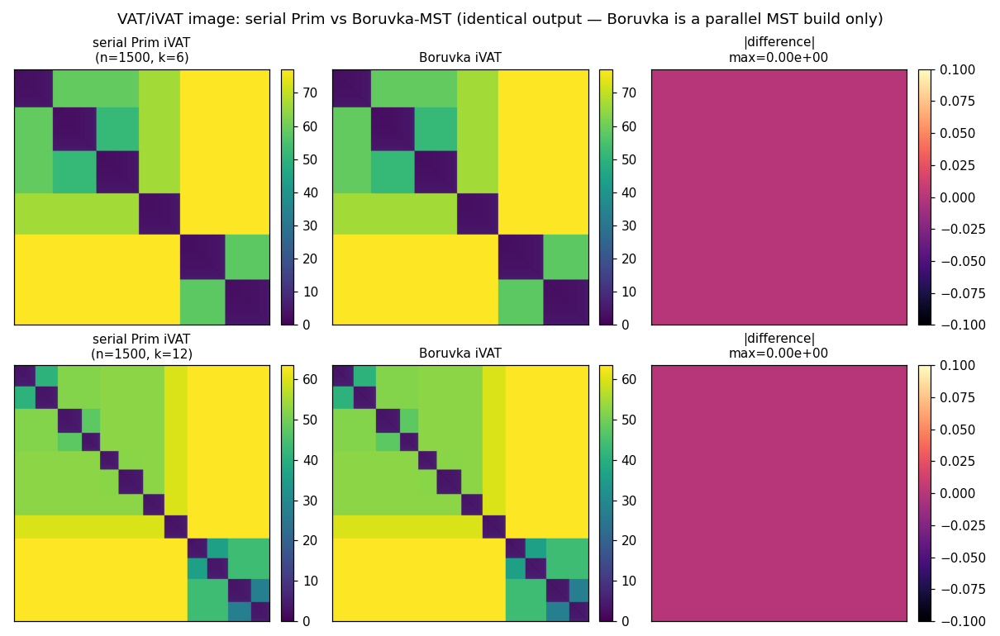

# Spike: Borůvka parallel MST for VAT — findings

**Question:** can a parallel MST (Borůvka) speed up VAT/iVAT, where the serial
Prim round-loop is the inherently-sequential core?

## The key observation (why the output is *exact*, not approximate)

VAT's ordering is Prim's vertex-insertion order, and by the cut property Prim
only ever traverses **MST edges**. So we can build the MST by *any* method and
then run Prim **restricted to the MST tree** from the same seed (the
global-maximum-dissimilarity vertex) to reproduce the exact VAT ordering — and
hence the exact iVAT image. Parallel VAT therefore reduces to **parallel MST +
an O(n log n) tree traversal**, with no approximation.

Confirmed: the Borůvka-derived VAT order matches serial Prim's on every tested
size (`order_match = 1.0000`), and the iVAT images are bit-identical
(`max |serial − Borůvka| = 0.0`).

## CPU Borůvka — a modest, eroding win

Borůvka does O(n² log n) work (O(log n) rounds, each an O(n²) min-outgoing-edge
scan) — a log factor *more* than serial compact-Prim's O(n²) — so it can only
win by parallelism. On 32 cores (Numba) the parallel min-edge scan beats the
(already highly optimized) serial C/OpenMP Prim at small–mid n, but the extra
log-factor work erodes the lead as n grows (≈1.4× at n=8000, tied by n≈32000).

## Real device-side GPU Borůvka (the follow-through)

A first *naive* CuPy port (per-round `n×n` mask + host union-find) was 3–8×
**slower** — allocation- and host-sync-bound. Replacing it with a real
device-side implementation (`experiments/boruvka_gpu.py`) changes the picture.
Every round runs on the GPU:

1. **`min_out_edge`** — one block per row; threads scan the row *coalesced* and
   block-reduce to each vertex's minimum edge leaving its component.
2. **`reduce_minw` / `pick_vertex`** — per-component `atomicMin` on the
   monotonic `u64` bit-cast of the (non-negative) weight, then `atomicMin` on
   the vertex index to break ties deterministically. No `n×n` temporaries.
3. **`hook`** — each root hooks to its neighbour's component; mutual 2-cycles
   resolved so the shared edge is emitted once (atomic edge counter).
4. **`relabel` + sync-free pointer-jumping** — parallel union-find on-device;
   only one scalar (edge count) crosses to the host per round.

Still **exact**: valid spanning tree, MST weight equal to the CPU MST, VAT order
match `1.0000`, iVAT image diff `0.0` at every tested size.

MST build time (ms), and speedup of the device-resident GPU vs serial Prim:

| n | serial Prim | Borůvka Numba | **GPU (resident)** | GPU (+transfer) | GPU speedup |
|-----|------------|---------------|--------------------|-----------------|-------------|
| 2000 | 3.1 | 0.9 | **1.4** | 8.6 | 2.2× |
| 4000 | 16.0 | 11.4 | **4.0** | 28.8 | 4.0× |
| 8000 | 94.9 | 48.8 | **12.5** | 119.8 | 7.6× |
| 16000 | 222.3 | 191.5 | **42.7** | 316.7 | 5.2× |
| 32000 | 901.5 | 914.6 | **180.6** | 1938.2 | 5.0× |

The device-resident GPU Borůvka is a **solid ~5× win that does NOT erode with n**
(the GPU has the memory bandwidth for the repeated O(n²) scans that O(n²·log n)
demands) — the opposite of the CPU Numba curve, which ties serial Prim by
n=32000. The dashed line is the catch: **including the host→device transfer of
the `n×n` matrix, the GPU loses** (transfer dominates, exactly as for GPU
pairwise distances).

## Verdict

- **Exactness:** Borůvka-MST VAT is provably and empirically identical to serial
  Prim VAT (contrast the O(n³) `(min,max)` closure, which was exact but hopeless).
- **Speed:** the **device-resident GPU Borůvka is a real ~5× MST-build win** that
  holds up as n grows. On the CPU, Borůvka is only a modest, eroding win.
- **The one condition:** the distance matrix must already be **on the GPU** — the
  host→device transfer of the `n×n` matrix erases the gain. This is precisely
  satisfied by a **fully on-device VAT front-end**: compute distances on the GPU
  (`tribbleclustering.gpu.pairwise_distances_gpu` already does this, tiled) and
  hand the *resident* matrix straight to GPU Borůvka, never copying it to host.
- **Recommendation:** promote GPU Borůvka to a real feature *as part of* an
  end-to-end on-device VAT path (distances → MST → order on the GPU, only the
  small permutation/labels returning to host). The MST portion then runs ~5×
  faster with bit-identical output. The remaining O(n²) iVAT gather/recurrence
  can follow the same on-device route later.

## Files

- `experiments/boruvka_vat.py` — Numba Borůvka, VAT-order-from-MST, quality &
  scaling figures.
- `experiments/boruvka_gpu.py` — the real device-side CuPy RawKernel Borůvka.
- `experiments/figures/boruvka_vat_{quality,scaling}.png`.
