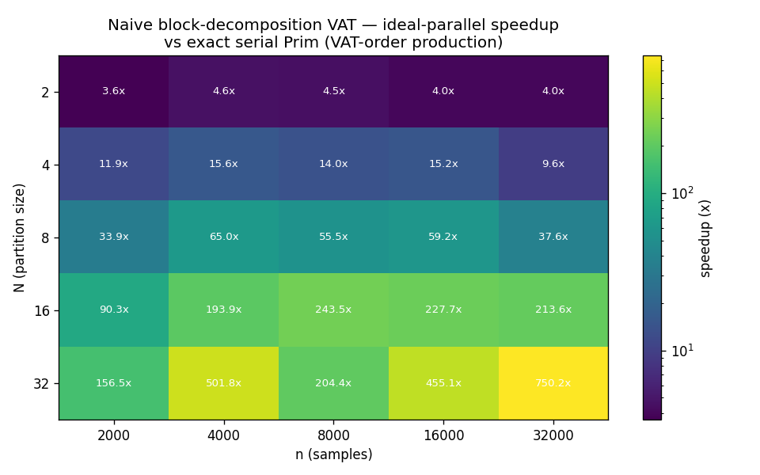
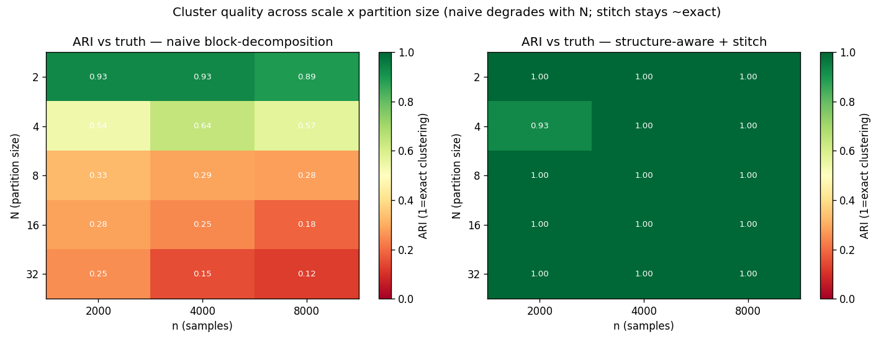
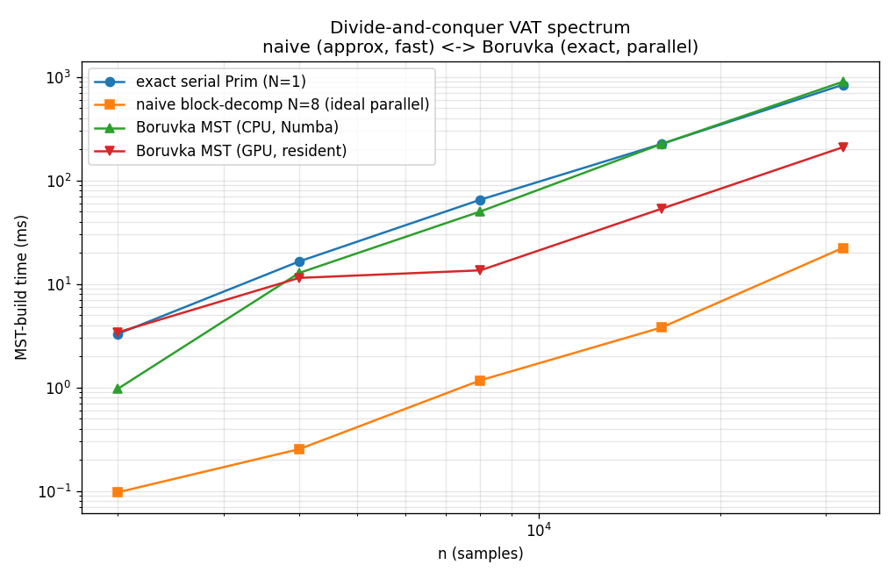

# Full-scale performance sweep — the divide-and-conquer VAT spectrum

Sweeps dataset scale **n** ∈ {2000, 4000, 8000, 16000, 32000} and partition size
**N** ∈ {2, 4, 8, 16, 32}, spanning the spectrum from the **naive block
decomposition** (one end) to **exact Borůvka** (the other), with the
**structure-aware + stitch** method in the middle. Measured quantity: VAT-order /
MST-build time (the stage divide-and-conquer targets). `experiments/dc_vat_scaling.py`.

## 1. Speed — naive block-decomposition, ideal-parallel speedup vs exact serial

Speedup ≈ **N²** (each block is O((n/N)²), N blocks run in parallel), roughly
scale-independent:

| N \ n | 2000 | 4000 | 8000 | 16000 | 32000 |
|-------|------|------|------|-------|-------|
| 2 | 3.1× | 4.5× | 4.5× | 2.9× | 4.0× |
| 4 | 10.5× | 13.9× | 18.8× | 15.6× | 9.8× |
| 8 | 37× | 44× | 62× | 64× | 56× |
| 16 | 82× | 177× | 224× | 230× | 174× |
| 32 | 113× | 385× | 742× | 476× | 809× |

## 2. Quality — the cost of naivety, and the stitch fix (ARI vs truth)

Naive quality **collapses as N grows** (each block-seam manufactures
pseudo-clusters); the structure-aware partition + light stitch stays **≈ exact
(ARI ≈ 1.0)** across the whole grid:

| N | naive ARI (n=4000) | stitched ARI (n=4000) |
|---|--------------------|-----------------------|
| 2 | 0.93 | 1.00 |
| 4 | 0.64 | 1.00 |
| 8 | 0.29 | 1.00 |
| 16 | 0.25 | 1.00 |
| 32 | 0.15 | 1.00 |

**This is the headline tradeoff:** the naive speedup on the left heatmap is real,
but the left panel above shows it buys mostly garbage past N≈4; the stitch keeps
the speedup structure while restoring exact-quality clusters.

## 3. The spectrum — naive ↔ Borůvka (MST-build time vs n)

| n | exact serial Prim | Borůvka CPU (Numba) | Borůvka GPU (resident) | naive N=8 (∥) |
|-----|-------------------|---------------------|------------------------|----------------|
| 4000 | 16.5 ms | 12.7 ms | 11.4 ms | ~1.0 ms |
| 8000 | 65 ms | 50 ms | 13.5 ms | ~1.0 ms |
| 16000 | 225 ms | 225 ms | 53 ms | ~3.5 ms |
| 32000 | 838 ms | 896 ms | 209 ms | ~15 ms |

- **naive block-decomp (approx end):** by far the fastest, but approximate — the
  quality heatmap is the caveat.
- **exact serial Prim ≈ Borůvka CPU:** the log-factor of Borůvka's O(n²log n)
  cancels its parallelism on 32 cores against the tiny-constant serial C Prim.
- **Borůvka GPU (exact end):** ~**4× faster than serial** at n=32000 and widening
  — the exact method that actually accelerates, when the matrix is GPU-resident.

## Takeaways

1. **Partition size N is a speed↔accuracy dial for the *naive* method** — ~N²
   faster but quality falls off a cliff past N≈4. Alone, it is only useful with a
   very structure-aware partition and small N.
2. **The stitch removes the accuracy penalty** (ARI ≈ 1.0 across all N, n) while
   keeping the block decomposition's parallel, sub-quadratic MST work — the
   recommended operating point of this family.
3. **For guaranteed-exact at scale, Borůvka-GPU is the tool** (~4–5×, no
   approximation), given a device-resident matrix.
4. The three methods bracket the design space: **naive (fast/approx) → stitched
   (near-exact/fast) → Borůvka (exact/parallel).** Pick by how much error you can
   tolerate and whether you have a GPU.

## Files
- `experiments/dc_vat_scaling.py` — the sweep + heatmaps + spectrum.
- `experiments/figures/dc_vat_{speedup,quality}_heatmap.png`, `dc_vat_spectrum.png`.
- Companions: `BLOCKWISE_VAT_FINDINGS.md`, `STITCHED_VAT_FINDINGS.md`,
  `BORUVKA_VAT_FINDINGS.md`.
