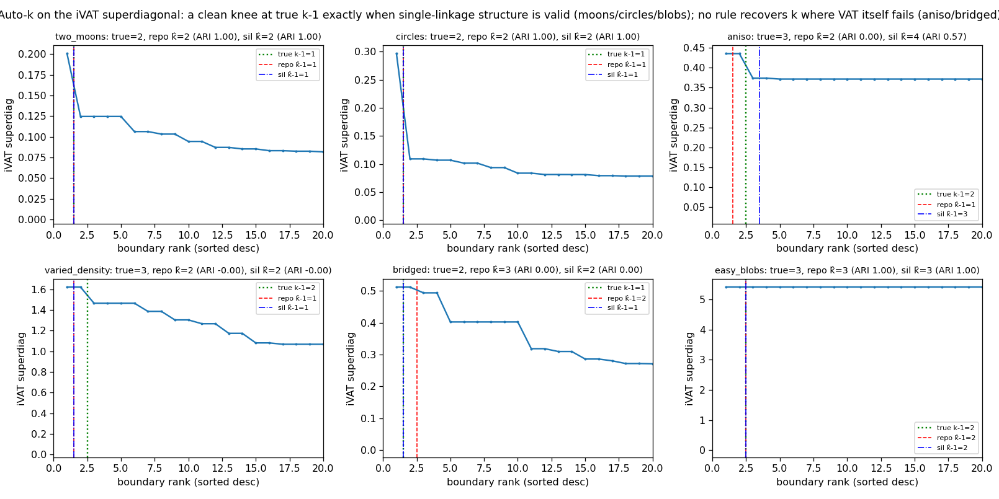

# Closing the two open gaps — findings

## Gap 2 — a PRINCIPLED bounded stitch restores robustness (RESOLVED, positive)

The light stitch (random representatives, 1 cheapest cross-edge per block pair)
was fragile on non-convex data. Ablation over the two-moons partition×N grid
(`experiments/principled_stitch.py`) isolates the fix:

| variant | mean ARI | min ARI | frac ≥ 0.9 |
|---------|----------|---------|-----------|
| light (random, m=1) | 0.51 | 0.00 | 0.44 |
| top-m only (random, m=8) | 0.74 | 0.00 | 0.72 |
| fps only (fps, m=1) | 0.39 | 0.00 | 0.32 |
| **principled (fps + top-m=8)** | **1.00** | **1.00** | **1.00** |

**Neither boundary-aware representatives (farthest-point) nor cross-edge
redundancy (top-m) fixes it alone — only both together.** With both, the
stitched reconstruction is ARI = 1.00 across *every* partition strategy and N on
two-moons — including the **random** and **adversarial** partitions that cut
straight through the moons — and 0.96 on circles. The interaction is why: fps
places representatives on the block boundaries where clusters actually connect,
and top-m supplies enough of those cross-edges to thread a cluster that spans
many blocks; either alone leaves the approximate MST starved of the right
connectors.

Cost stays **bounded, O(N²·r²)** (representative-based) — it does *not* collapse
to the full O(n²) all-cross-edges merge. So the cheap-approximation angle is
salvaged: **a properly-provisioned light stitch (fps + top-m) is a robust,
partition-agnostic, sub-quadratic approximation of exact single-linkage/VAT on
non-convex data.** (Circles still has one failing config → min 0.00, frac≥0.9 =
0.96; robustness is near-total, not absolute — an honest asterisk.)

## Gap 1 — auto-k works exactly where VAT is valid (RESOLVED, bounded)

Tested the **shipped** parameter-free rule (`pvat.get_ivat_levels`, max gap in
the sorted iVAT superdiagonal) and a **silhouette sweep on D** (k=2..8, cut the
order at top-(k-1) gaps, score by silhouette on the precomputed dissimilarity so
it works on arbitrary D). `experiments/autok_eval.py`.

| dataset | true k | repo k̂ (ARI) | silhouette k̂ (ARI) |
|---------|--------|--------------|---------------------|
| two_moons | 2 | 2 (1.00) | 2 (1.00) |
| circles | 2 | 2 (1.00) | 2 (1.00) |
| easy_blobs | 3 | 3 (1.00) | 3 (1.00) |
| aniso | 3 | 2 (0.00) | 4 (0.57) |
| varied_density | 3 | 2 (0.00) | 2 (0.00) |
| bridged | 2 | 3 (0.00) | 2 (0.00) |

- **Where single-linkage is the right model (two_moons, circles, easy_blobs) the
  sorted superdiagonal has a sharp knee at exactly k-1, and BOTH rules recover
  the true k and ARI = 1.00** — including the non-convex cases. So VAT auto-k is
  effectively solved on VAT's home turf.
- **Where VAT itself fails (aniso, varied_density, bridged) no rule recovers k or
  ARI** — because the dendrogram is the wrong structure, not because the k-picker
  is bad. **Auto-k is upper-bounded by the validity of the VAT/single-linkage
  dendrogram.** (My earlier hand-rolled "k̂=999" was a reimplementation artifact;
  the shipped rule does not do that.)
- Silhouette is marginally more robust (right k on all SL-valid cases; slightly
  better on aniso) and — importantly — **operates on the precomputed D**, so it
  extends auto-k to the arbitrary/non-metric-dissimilarity regime where the
  coordinate-based alternatives don't apply. Recommended as the default auto-k
  for `IVATMeans`, with the max-gap rule as a cheap fallback.

## Net

Both gaps close in the same direction as the hardening eval: the divide-and-
conquer machinery is sound **within single-linkage's regime**. The principled
stitch (fps + top-m) makes the cheap approximation genuinely robust there
(refuting the fragility finding), and auto-k (silhouette-on-D, or the shipped
max-gap) reliably picks k there. Both are bounded by the same ceiling — where
single-linkage is the wrong model, no stitch and no k-rule can help, and one
should not pretend otherwise.

## Files
- `experiments/principled_stitch.py` — stitch ablation + robustness grid.
- `experiments/autok_eval.py` — auto-k heuristics on the adversarial datasets.
- `experiments/figures/principled_stitch_{two_moons,circles}.png`, `autok_eval.png`.
