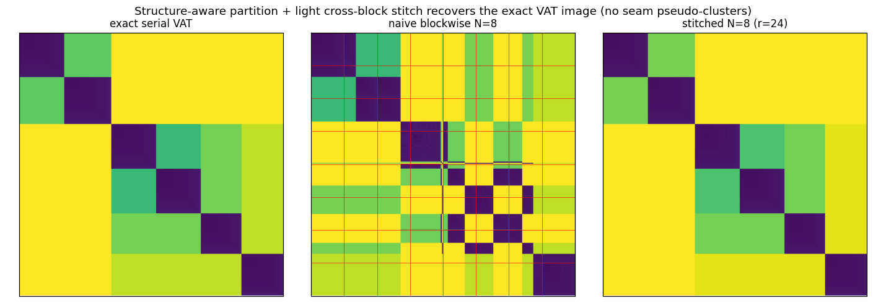

# Spike: structure-aware partition + light cross-block stitch VAT — findings

> **Critical caveat (read `ADVERSARIAL_EVAL_FINDINGS.md`).** The ARI=1.0 numbers
> below are on Gaussian **blobs**, where k-means already scores ~1.0 — so on
> their own they do NOT prove the stitch beats its k-means partition. The
> adversarial evaluation (non-convex data + k-means/single-linkage controls) is
> what actually validates the method: on two-moons/circles k-means fails (0.27,
> 0.00) while stitched hits 1.0 = exact single-linkage, refuting the confound —
> AND it honestly inherits single-linkage's failures (aniso, bridged). Trust the
> adversarial results, not the blob numbers here.

The fix for the block-decomposition seam artifact
(`BLOCKWISE_VAT_FINDINGS.md`), sitting between naive block-concat (approximate,
~N² parallel, seams) and exact Borůvka-VAT (all cross-edges, no seams).

**Pipeline** (`experiments/stitched_vat.py`):
1. **Structure-aware partition** — coarse k-means into N blocks (spatially
   coherent; rarely splits a true cluster).
2. **Per-block exact MST** — Prim on each O((n/N)²) sub-matrix → a forest of N
   sub-MSTs (embarrassingly parallel).
3. **Light stitch** — pick `r` representatives per block, add the cheapest
   representative cross-edge per block pair (O(N²·r²)), then take the MST of
   {block-MST edges} ∪ {cross candidates}. This connects the forest into an
   **approximate global MST that interleaves across boundaries** — the step
   naive concatenation skips, and the exact reason the seam artifact vanishes.
4. **VAT order** = Prim traversal of that MST from the max-dissimilarity seed.

`r` interpolates: `r → full block` = exact Borůvka-VAT; `r` small = cheap.

## It recovers the exact image

Exact → naive N=8 (seams) → stitched N=8 (clean, ≈ exact):

## Quality — recovers exact clustering (n=4000, k=10; ideal runs=10, ARI=1.0)

| method | runs | ARI |
|--------|------|-----|
| exact serial | 10 | 1.000 |
| naive blockwise (coord) N=4 / 8 / 16 | 16 / 18 / 25 | 0.713 / 0.660 / 0.640 |
| **stitched N=4 / 8 / 16** | **10 / 10 / 10** | **1.000 / 1.000 / 1.000** |

The stitch removes the seam artifact entirely and returns the ideal 10 runs at
every N. **Representative count is cheap:** even `r=4` gives ARI 1.000 (r sweep
4→64 all 1.000 on this data).

## Robustness — how far does "≈ exact" hold?

Overlapping clusters (increasing `spread`; `stitch_vs_exact` = label agreement
between stitched and the exact serial VAT):

| spread | exact ARI | stitched ARI | stitched↔exact |
|--------|-----------|--------------|----------------|
| 2 (well sep.) | 1.000 | 1.000 | 1.000 |
| 6 (mild) | 0.894 | 0.894 | 1.000 |
| 10 (heavy) | 0.437 | 0.605 | 0.779 |
| 14 (≈ no structure) | 0.000 | 0.110 | 0.011 |

- **Separable–moderate overlap: stitched == exact** (agreement 1.0).
- Also exact even when clusters span blocks (k=25, N=8 → ARI 1.000, runs 25).
- **Heavy overlap:** the representative-based approximate MST diverges from the
  exact MST (agreement 0.78) — precisely the regime where VAT itself is already
  unreliable (exact ARI 0.44). Honest limit: the approximation is trustworthy
  where the cluster structure is, and degrades where it isn't.

## Performance (serial, un-parallelized)

| n | exact iVAT ms | stitched ms | speedup |
|-----|---------------|-------------|---------|
| 4000 | 97 | 60 | 1.6× |
| 8000 | 344 | 154 | 2.2× |
| 16000 | 1356 | 527 | 2.6× |

This is **serial** stitched (per-block Prim in Numba, slower than the C engine)
vs the optimized C `compute_ivat_c`, and it *already* wins 1.6–2.6×. The N
per-block MSTs are embarrassingly parallel (O((n/N)²) each), so the parallel
ceiling is far higher (toward the block-decomposition's ~N²); the stitch itself
is O(N²·r² + n log n), negligible.

## Verdict

**The sweet spot works.** A structure-aware partition plus a light,
representative-based cross-block stitch **recovers exact-equivalent VAT/iVAT**
(agreement 1.0, ARI = exact) for separable-to-moderately-overlapping data — the
seam pseudo-clusters are gone — while retaining the block decomposition's
parallel, sub-quadratic MST work (1.6–2.6× even serial, much more parallel). It
degrades gracefully to "approximate" exactly where VAT is already ambiguous
(heavy overlap). `r` is a clean accuracy↔cost dial toward exact Borůvka.

Still a research prototype (not shipped): the honest positioning is a **fast,
near-exact approximate VAT** — it is *not* guaranteed bit-identical to serial VAT
(the cross-edges are representative-based, not exhaustive), so it is not "exact"
in the sense Borůvka-VAT is. For guaranteed-exact, use Borůvka-VAT
(`BORUVKA_VAT_FINDINGS.md`); for max speed with a good partition, use this.

## Files
- `experiments/stitched_vat.py` — k-means partition, per-block Prim, light
  stitch, quality/robustness/perf harness, figure.
- `experiments/figures/stitched_vat_quality.png`.
