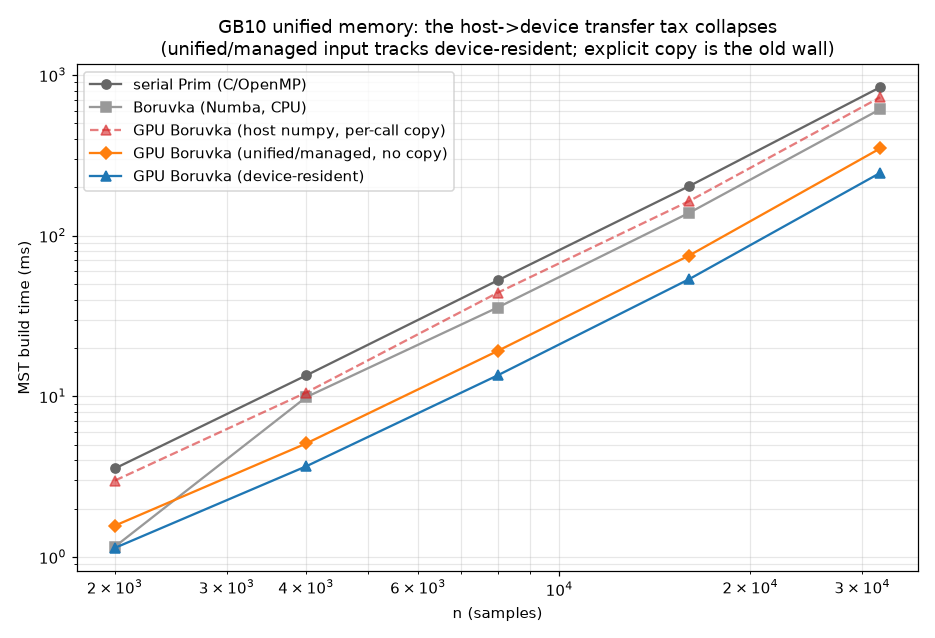
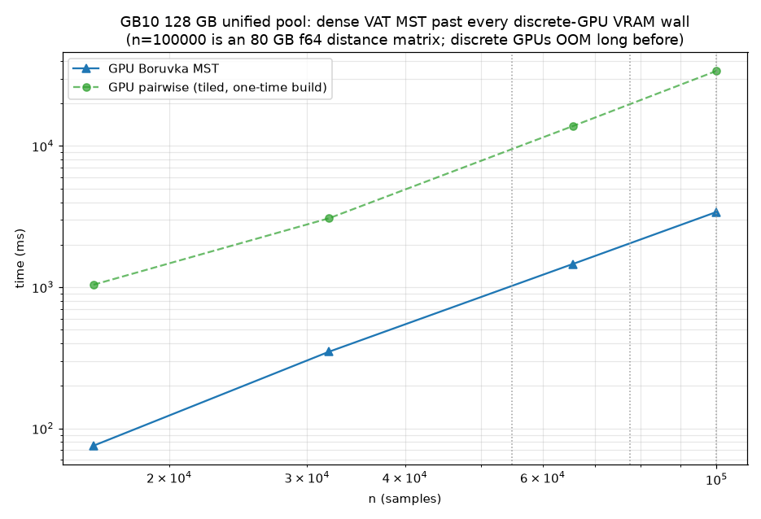

# Spike: Borůvka parallel MST for VAT — findings

**Question:** can a parallel MST (Borůvka) speed up VAT/iVAT, where the serial
Prim round-loop is the inherently-sequential core?

## The key observation (why the output is *exact*, not approximate)

VAT's ordering is Prim's vertex-insertion order, and by the cut property Prim
only ever traverses **MST edges**. So we can build the MST by *any* method and
then run Prim **restricted to the MST tree** from the same seed (the
global-maximum-dissimilarity vertex) to reproduce the exact VAT ordering — and
hence the exact iVAT image. Parallel VAT therefore reduces to **parallel MST +
an O(n log n) tree traversal**, with no approximation.

Confirmed: the Borůvka-derived VAT order matches serial Prim's on every tested
size (`order_match = 1.0000`), and the iVAT images are bit-identical
(`max |serial − Borůvka| = 0.0`).

## CPU Borůvka — a modest, eroding win

Borůvka does O(n² log n) work (O(log n) rounds, each an O(n²) min-outgoing-edge
scan) — a log factor *more* than serial compact-Prim's O(n²) — so it can only
win by parallelism. On 32 cores (Numba) the parallel min-edge scan beats the
(already highly optimized) serial C/OpenMP Prim at small–mid n, but the extra
log-factor work erodes the lead as n grows (≈1.4× at n=8000, tied by n≈32000).

## Real device-side GPU Borůvka (the follow-through)

A first *naive* CuPy port (per-round `n×n` mask + host union-find) was 3–8×
**slower** — allocation- and host-sync-bound. Replacing it with a real
device-side implementation (`experiments/boruvka_gpu.py`) changes the picture.
Every round runs on the GPU:

1. **`min_out_edge`** — one block per row; threads scan the row *coalesced* and
   block-reduce to each vertex's minimum edge leaving its component.
2. **`reduce_minw` / `pick_vertex`** — per-component `atomicMin` on the
   monotonic `u64` bit-cast of the (non-negative) weight, then `atomicMin` on
   the vertex index to break ties deterministically. No `n×n` temporaries.
3. **`hook`** — each root hooks to its neighbour's component; mutual 2-cycles
   resolved so the shared edge is emitted once (atomic edge counter).
4. **`relabel` + sync-free pointer-jumping** — parallel union-find on-device;
   only one scalar (edge count) crosses to the host per round.

Still **exact**: valid spanning tree, MST weight equal to the CPU MST, VAT order
match `1.0000`, iVAT image diff `0.0` at every tested size.

MST build time (ms), and speedup of the device-resident GPU vs serial Prim:

| n | serial Prim | Borůvka Numba | **GPU (resident)** | GPU (+transfer) | GPU speedup |
|-----|------------|---------------|--------------------|-----------------|-------------|
| 2000 | 3.1 | 0.9 | **1.4** | 8.6 | 2.2× |
| 4000 | 16.0 | 11.4 | **4.0** | 28.8 | 4.0× |
| 8000 | 94.9 | 48.8 | **12.5** | 119.8 | 7.6× |
| 16000 | 222.3 | 191.5 | **42.7** | 316.7 | 5.2× |
| 32000 | 901.5 | 914.6 | **180.6** | 1938.2 | 5.0× |

The device-resident GPU Borůvka is a **solid ~5× win that does NOT erode with n**
(the GPU has the memory bandwidth for the repeated O(n²) scans that O(n²·log n)
demands) — the opposite of the CPU Numba curve, which ties serial Prim by
n=32000. The dashed line is the catch: **including the host→device transfer of
the `n×n` matrix, the GPU loses** (transfer dominates, exactly as for GPU
pairwise distances).

## DGX Spark (GB10): unified memory dissolves the transfer wall

The numbers above were on a discrete GPU, where the dashed "+transfer" line is
the whole story: copying the `n×n` matrix over PCIe cost ~10× the resident
kernel and sank the GPU for host-resident data. Re-running on an **NVIDIA DGX
Spark (GB10 Grace-Blackwell)** — where the CPU and GPU share ~128 GB of coherent
LPDDR5X over NVLink-C2C — changes the conclusion in two ways.

**1. The transfer tax collapses (10.7× → ~3×), and unified memory nearly erases
it.** GB10's GPU is smaller than the discrete card, so the *device-resident*
kernel is a touch slower in absolute ms — but the copy penalty is far cheaper,
and allocating the matrix in **CUDA managed (unified) memory** removes the
explicit copy altogether. MST build time (ms), same blobs, `experiments/boruvka_dgx_spark.py`:

| n | serial Prim | Borůvka Numba | GPU resident | GPU **unified** (no copy) | GPU host+copy |
|------|------------|---------------|--------------|---------------------------|---------------|
| 2000 | 3.6 | 1.2 | 1.1 | **1.6** | 3.0 |
| 4000 | 13.5 | 9.9 | 3.7 | **5.1** | 10.5 |
| 8000 | 52.6 | 35.6 | 13.5 | **19.1** | 44.0 |
| 16000 | 202.8 | 138.2 | 53.4 | **75.0** | 163.6 |
| 32000 | 838.8 | 612.0 | 245.7 | **349.1** | 726.4 |

The unified/managed input tracks device-resident within ~1.4× and is **~2.1×
faster than the explicit-copy path** (349 vs 726 ms at n=32000) — with only *one*
`n×n` allocation instead of two. It also beats CPU Numba Borůvka (2.4×) and
serial Prim (1.75×) *for host-resident data*, which the discrete GPU could not.
Still exact (MST weight parity with the CPU MST at every size).

**2. The 128 GB unified pool runs VAT MST past every discrete-GPU VRAM wall.**
A dense f64 `n×n` matrix hits 24/48/80 GB at n≈54.7k / 77.5k / 100k, so discrete
GPUs OOM there — and the old host→device path OOMs *even sooner* on GB10 because
`cp.asarray(D)` needs a second `n×n` buffer (host **and** device copy). Building
the matrix **on the device** (tiled `pairwise_distances_gpu`, single unified
allocation) avoids the doubling and roughly doubles the reachable n:

| n | D size | GPU pairwise (one-time) | **GPU Borůvka MST** | edges |
|-------|--------|-------------------------|---------------------|-------|
| 16000 | 2.0 GB | 1.0 s | **75 ms** | 15999/15999 |
| 32000 | 8.2 GB | 3.1 s | **349 ms** | 31999/31999 |
| 65536 | 34.4 GB | 13.8 s | **1.46 s** | 65535/65535 |
| 100000 | 80.0 GB | 34.0 s | **3.41 s** | 99999/99999 |

n=100000 is an **80 GB** distance matrix held in the shared pool with a correct
spanning tree — a size no single discrete GPU can hold at all.

**Takeaway for GB10:** the discrete-GPU verdict's "one condition" (matrix must be
device-resident) is satisfied *for free* by unified memory — allocate the matrix
once with `boruvka_gpu.alloc_unified` / `as_unified` (or build it on-device with
`pairwise_distances_gpu`) and both the CPU distance build and the GPU MST touch
the same pages with no copy. The device-resident win survives, the transfer wall
does not, and the memory ceiling moves from tens of GB to ~128 GB.

## Verdict

- **Exactness:** Borůvka-MST VAT is provably and empirically identical to serial
  Prim VAT (contrast the O(n³) `(min,max)` closure, which was exact but hopeless).
- **Speed:** the **device-resident GPU Borůvka is a real ~5× MST-build win** that
  holds up as n grows. On the CPU, Borůvka is only a modest, eroding win.
- **The one condition:** the distance matrix must already be **on the GPU** — the
  host→device transfer of the `n×n` matrix erases the gain. This is precisely
  satisfied by a **fully on-device VAT front-end**: compute distances on the GPU
  (`tribbleclustering.gpu.pairwise_distances_gpu` already does this, tiled) and
  hand the *resident* matrix straight to GPU Borůvka, never copying it to host.
- **Recommendation:** promote GPU Borůvka to a real feature *as part of* an
  end-to-end on-device VAT path (distances → MST → order on the GPU, only the
  small permutation/labels returning to host). The MST portion then runs ~5×
  faster with bit-identical output. The remaining O(n²) iVAT gather/recurrence
  can follow the same on-device route later.

## Files

- `experiments/boruvka_vat.py` — Numba Borůvka, VAT-order-from-MST, quality &
  scaling figures.
- `experiments/boruvka_gpu.py` — the real device-side CuPy RawKernel Borůvka,
  plus `alloc_unified` / `as_unified` (managed-memory helpers) and a tiled
  `pairwise_distances_gpu` that builds the matrix on-device.
- `experiments/boruvka_dgx_spark.py` — DGX Spark (GB10) study: transfer-mode
  comparison + large-n capability (matrix born on the device).
- `experiments/figures/boruvka_vat_{quality,scaling}.png`,
  `experiments/figures/boruvka_dgx_{transfer,largen}.png`.
