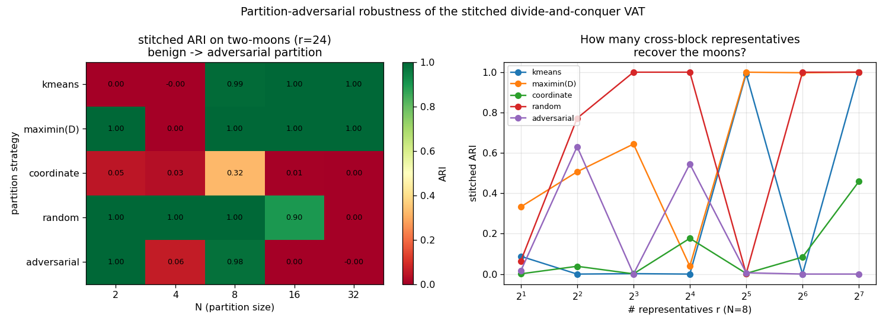

# Hardening the divide-and-conquer VAT claim — findings

Two experiments a reviewer demanded after the adversarial eval:
`experiments/hardening_eval.py`.

## Part A — arbitrary / non-metric dissimilarity: **claim STRENGTHENS**

VAT's native input is a dissimilarity matrix, not coordinates — so it (and the
coordinate-free MaxiMin-partition stitch, `stitched_vat_from_D`) can consume
dissimilarities that k-means / kd-tree-EMST / coordinate partitioners **cannot**.
Tested that the stitch still reproduces **exact single-linkage** regardless of
metricity:

| data | dissimilarity | triangle-viol. | SL | VAT | stitch(D) | stitch↔VAT |
|------|---------------|----------------|----|-----|-----------|------------|
| blobs | euclidean (metric) | 0.0% | 1.00 | 1.00 | 1.00 | 1.00 |
| blobs | fractional p=0.5 (**non-metric**) | 14.1% | 1.00 | 1.00 | 1.00 | 1.00 |
| blobs | cosine (non-Euclidean) | 32.9% | 0.58 | 0.58 | 0.58 | 1.00 |
| moons | euclidean | 0.0% | 1.00 | 1.00 | 0.99 | 0.99 |
| moons | kNN-geodesic (non-Euclidean) | 0.0% | 1.00 | 1.00 | 1.00 | 1.00 |

- The fractional p=0.5 Minkowski dissimilarity **violates the triangle
  inequality 14% of the time** (genuinely non-metric); the stitch still ==
  exact single-linkage (agreement 1.0). No metric assumption is used — the
  method treats D as a graph.
- cosine ARI is only 0.58, but that is the *dissimilarity* being a poor fit for
  those blobs, **not** a stitch failure: stitch == VAT == SL (agreement 1.0).
- Works on the geodesic (manifold) dissimilarity where coordinate methods can't
  play. **This is the defensible niche: exact single-linkage/VAT on arbitrary,
  non-metric dissimilarities, coordinate-free.**

## Part B — partition-adversarial robustness: **claim WEAKENS (important)**

On two-moons, does a bad partition break the stitch? Swept partition strategy ×
N × #representatives r. **The light stitch is fragile and unstable on hard
non-convex data.**

stitched ARI on two-moons (r=24):

| partition \ N | 2 | 4 | 8 | 16 | 32 |
|---------------|---|---|---|----|----|
| kmeans | 0.00 | 0.00 | 0.99 | 1.00 | 1.00 |
| maximin(D) | 1.00 | 0.00 | 1.00 | 1.00 | 1.00 |
| coordinate | 0.05 | 0.03 | 0.32 | 0.01 | 0.00 |
| random | 1.00 | 1.00 | 1.00 | 0.90 | 0.00 |
| adversarial | 1.00 | 0.06 | 0.98 | 0.00 | 0.00 |

The grid is a **checkerboard** — ARI swings between 0 and 1 with no clean
monotone structure, and the r-sweep (N=8) is likewise **non-monotonic** (e.g.
k-means partition: r=32→0.99, r=64→0.00, r=128→1.00). See the figure.

**Interpretation (honest):** the earlier "stitched → 1.0 at N=8" on two-moons was
a *favorable operating point*, not a robust guarantee. The stitch adds only the
single cheapest representative cross-edge per block pair; on non-convex data the
cheapest cross-edge frequently connects the *wrong* arc, so whether the true
reconnecting edge is captured depends erratically on (partition, N, r). Reliable
non-convex recovery needs *more* correct cross-block edges — i.e. it converges to
the full cross-edge merge, which is **exact Borůvka-VAT** (more cost). The "light"
stitch trades robustness for cheapness, and on hard data that trade bites.

## Net effect on the "genuinely rich result"

Sharpened and, honestly, **relocated toward the exact end**:

1. **Solid:** exact VAT/single-linkage — and its parallel Borůvka realization —
   on **arbitrary, non-metric dissimilarities** (Part A), a regime k-means /
   kd-tree / sampling methods do not serve. This is the real, defensible niche.
2. **Solid:** exact VAT beats k-means on non-convex data (adversarial eval), and
   the machinery is dissimilarity-agnostic (Part A).
3. **Now bounded:** the *cheap light stitch* is a promising heuristic but **not a
   robust drop-in for exact** on hard non-convex data — it is only dependable on
   easy/separable data or lucky configs (Part B). For guarantees, use the full
   merge (Borůvka), which the performance work already makes parallel/GPU-fast.

So the mature thesis is about the **exact, parallel, arbitrary-dissimilarity
VAT engine** (Borůvka-VAT), with block-decomposition + light stitch documented as
a fast-but-fragile approximation whose reliable limit *is* that exact engine.

## Files
- `experiments/hardening_eval.py` — non-metric dissimilarities + robustness sweep.
- `experiments/figures/hardening_partition_robustness.png`.
- `stitched_vat.stitched_vat_from_D` / `maximin_partition` — coordinate-free path.
