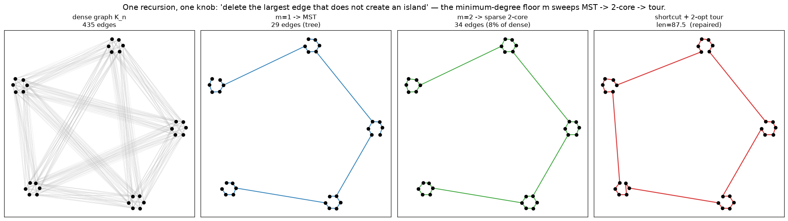
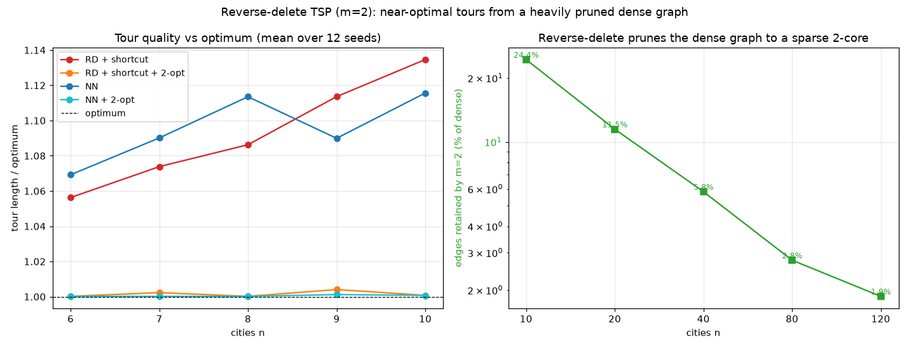

# Reverse-delete on dense graphs — one recursion from MST to TSP

**Date:** 2026-07-11 · `experiments/reverse_delete_tsp.py`

> **The idea (verbatim from the prompt):** *"recursively delete the largest edge
> that does not create an island."*

Start from a **dense (complete) weighted graph** and repeatedly remove the
heaviest edge whose removal keeps the graph connected — never leaving a vertex
or subgraph stranded as an "island". This is the classic **reverse-delete
algorithm** (Kruskal's less-famous twin), and on its own it terminates at the
**Minimum Spanning Tree**. The interesting part is that a *single knob* — the
minimum degree we refuse to drop below — turns the same recursion into a
travelling-salesman engine:

| knob `m` | rule added to "keep it connected" | fixed point |
|---|---|---|
| `m = 1` | none (islands are degree-0) | **Minimum Spanning Tree** (a tree) |
| `m = 2` | never drop a vertex below degree 2 | **2-regular connected graph = a Hamiltonian tour** |

Because the heaviest edges are shed first, what survives are the short local
hops a good tour wants — a purely *subtractive* cousin of nearest-neighbour and
greedy-edge construction. This also ties directly into the package: VAT's output
depends only on the MST, and reverse-delete (`m=1`) is the **dual construction**
of the Prim MST the VAT kernel builds by *adding* the lightest edges.

## 1. `m=1` is exactly the package's MST (duality, verified)

Reverse-delete's surviving edge set is bit-identical to both a reference
Kruskal MST and the MST reconstructed from the package's Prim ordering
(`vat_prim_mst`), and the total weights match, across all sizes tested:

| n | RD edges == Kruskal | RD edges == Prim | weights match |
|----|----|----|----|
| 8 | ✓ | ✓ | ✓ |
| 16 | ✓ | ✓ | ✓ |
| 32 | ✓ | ✓ | ✓ |
| 64 | ✓ | ✓ | ✓ |
| 100 | ✓ | ✓ | ✓ |

So the two ends of the "add lightest / delete heaviest" duality land on the same
tree — reverse-delete is a second, independent route to the same VAT ordering.

## 2. `m=2` prunes a dense graph to a sparse 2-core

Left→right: the dense graph `K_n` → the `m=1` MST → the `m=2` survivor → the
finished tour. The `m=2` recursion is first and foremost a **connectivity-safe
sparsifier**: it discards nearly all of the `n(n-1)/2` edges while guaranteeing
the survivor stays connected with minimum degree 2.

| n | edges retained by `m=2` (% of dense) |
|-----|-----|
| 10 | 24.4% |
| 20 | 11.5% |
| 40 | 5.8% |
| 80 | 2.8% |
| 120 | 1.9% |

Retention falls like ≈ `2/n` — the survivor has ≈ `n` + a small excess of edges,
i.e. it is within a handful of edges of a pure tour.

## 3. `m=2` tour quality — near-optimal, from that pruned graph

Against the brute-force optimum on small instances (mean over 12 seeds):

| n | RD+shortcut | **RD+shortcut+2-opt** | NN | NN+2-opt | MST/opt |
|----|----|----|----|----|----|
| 6 | 1.048 | **1.000** | 1.061 | 1.000 | 0.671 |
| 8 | 1.090 | **1.002** | 1.104 | 1.005 | 0.699 |
| 10 | 1.118 | **1.001** | 1.125 | 1.004 | 0.733 |

- Raw reverse-delete+shortcut lands ~5–12% over optimum — comparable to raw
  nearest-neighbour, and a **near-optimal tour after a 2-opt polish** (≤0.2%).
- At larger n the finished tour is on par with `NN + 2-opt`
  (RD/NN ratio ≈ 0.99–1.01 across n = 20/50/100) — but produced from a
  **~40× sparser candidate edge set** (§2).
- `MST/opt ≈ 0.67–0.73` is the textbook MST lower bound (opt ≤ 2·MST),
  a sanity check that the distances and optima are right.

## 4. The honest limitation: pure `m=2` rarely reaches a tour by itself

The recursion is a **single fixed descending pass** and degrees only shrink, so a
globally-heavy edge that has become a *local bridge* between two high-degree hubs
can never be removed — the recursion stalls above degree 2. Convergence to a pure
2-regular graph without any repair:

| n | 6 | 8 | 10 | ≥20 |
|---|---|---|---|---|
| converged (single 2-regular cycle) | ~30% | ~20% | ~20% | ~0% |

For n ≥ 20 it essentially always stalls, leaving ~`n/10` excess-degree vertices.
That is why the pipeline finishes with a **shortcut step** (a nearest-neighbour
DFS walk over the surviving edges, then 2-opt) — the MST/2-factor shortcutting
trick applied to the pruned graph. This always yields a valid tour and is what
the §3 numbers measure.

## 5. Cost

Reverse-delete does `O(E)` deletion trials, each an `O(V+E)` connectivity probe
⇒ **`~O(n⁴)`** on a dense graph. Clean to reason about, but quadratically slower
to *build* than the package's `O(n²)` Prim MST. The value here is the unifying
`m`-knob framing and the connectivity-safe sparsification, **not** construction
speed — for the MST itself, Prim remains the production path.

## Takeaways

1. **One recursion, one knob.** "Delete the largest edge that keeps the graph an
   island-free whole" gives the **MST at `m=1`** and a **TSP tour at `m=2`** — the
   clustering side and the routing side of this repo from the same rule.
2. **`m=1` is the exact dual of the package's Prim MST** (edge set + weight,
   verified) — a second route to the VAT ordering.
3. **`m=2` is a connectivity-safe sparsifier** that keeps ≈ `2/n` of a dense
   graph's edges; completed with shortcut+2-opt it gives **near-optimal tours**
   (≤0.2% over optimum on small n; on par with NN+2-opt at scale) from that tiny
   edge set.
4. **Honest caveat:** the pure greedy stalls above degree 2 for n ≥ 20, so a
   repair/shortcut step is required; and the build is `O(n⁴)`, so this is a
   framing/quality result, not a speed result.

## Files
- `experiments/reverse_delete_tsp.py` — recursion, duality proof, tour pipeline,
  baselines (NN, 2-opt, brute-force), figures. Run: `python -m experiments.reverse_delete_tsp`.
- `experiments/figures/reverse_delete_process.png`, `reverse_delete_tsp_quality.png`.
