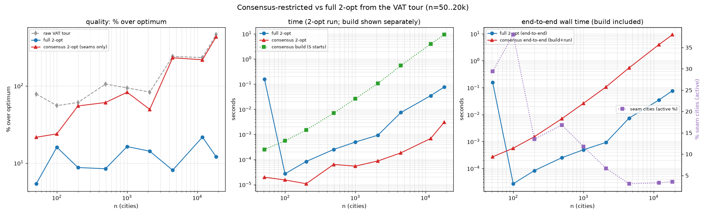

# 2-opt performance benchmark, n = 50 … 20 000 — and the consensus restriction

Two questions, both on time **and** quality (% over published optimum), from the
same VAT reference tour, nearest-size EUC_2D TSPLIB instances, official nint:
1. **How does 2-opt itself perform across n = 50–20k?** (strong pure neighbour-list
   2-opt, best-improvement, wrap-edge aware — the `lk_search` operator minus Or-opt).
2. **Does restricting 2-opt to the consensus seam cities** (freeze the consistent
   subsequences from `VAT_TSP_SEQVAR_FINDINGS.md`, only seam cities may initiate a
   move) match full 2-opt for less work?

Source: `experiments/vat_tsp_2opt_bench.py` (consensus built from S=24 sampled VAT
starts via a dict of consecutive pairs — no n×n matrix, scales to 20k).

## Results

| instance | n | raw VAT | **full 2-opt** | consensus 2-opt | seam % | t_full | t_cons-build |
|----------|------|---------|----------------|-----------------|--------|--------|--------------|
| eil51 | 51 | +78% | **+5.4%** | +21.6% | 29% | —¹ | 0.000 s |
| kroA100 | 100 | +55% | **+16.1%** | +23.9% | 38% | 0.00003 s | 0.001 s |
| kroA200 | 200 | +61% | **+8.8%** | +54.9% | 14% | 0.00009 s | 0.002 s |
| d493 | 493 | +105% | **+8.4%** | +60.8% | 17% | 0.0003 s | 0.007 s |
| pr1002 | 1 002 | +94% | **+16.4%** | +82.6% | 12% | 0.0005 s | 0.026 s |
| d2103 | 2 103 | +83% | **+14.2%** | +49.6% | 7% | 0.001 s | 0.107 s |
| fnl4461 | 4 461 | +240% | **+8.1%** | +230.9% | 3% | 0.007 s | 0.544 s |
| rl11849 | 11 849 | +232% | **+21.7%** | +217.5% | 3% | 0.035 s | 3.95 s |
| d18512 | 18 512 | +460% | **+12.1%** | +430.6% | 4% | 0.077 s | 9.28 s |

¹ n=51 t_full carries a one-off numba cache/first-call artifact (~0.15 s); ignore
it — the n≥100 timings are the real curve.

## 1. 2-opt performance (the headline)

**Strong pure 2-opt from the raw VAT tour reaches +5–22% over optimum across the
whole 50–20k range, in well under 0.1 s.** It cleans up raw VAT tours that are
+55% to +460% (the naive closure's long wrap/branch edges) down to canonical
2-opt quality, and the run time is trivial — **0.077 s at n=18 512** (the S-start
neighbour-list scan is O(n·k) per pass). This is the answer to "how does 2-opt
perform at scale here": fast and solid, though pure 2-opt alone plateaus around
+8–22%; the earlier **uncrossing pre-pass + Or-opt** pipeline
(`VAT_TSP_CROSS_FINDINGS.md`) is what pushes it toward ~5%.

## 2. The consensus restriction is a net loss

Restricting 2-opt to initiate only from the consensus seam cities is **worse on
quality and slower end-to-end**:

- **Quality collapses as n grows.** At small n it lands between raw and full
  (kroA100 +23.9% vs full +16.1%); by n ≥ 4461 only **3–4% of cities are seams**,
  so consensus 2-opt barely dents the raw tour (fnl4461 +240→+231%, rl11849
  +232→+218%, d18512 +460→+431%). Full 2-opt, unrestricted, gets those same
  instances to **+8–22%**.
- **Slower end-to-end.** The seam-restricted *run* is faster (it does almost
  nothing), but building the consensus costs **0.5–9.3 s** (S=24 VAT orders) —
  1–2 orders of magnitude more than full 2-opt's entire runtime (<0.08 s).
- **Why it fails.** The naive closed VAT tour's cost lives in its long
  *connective* edges between branches; repairing them needs 2-opt moves that
  originate all across the tour, not just at the ~3% consensus seams. The
  "consistent subsequences are good building blocks" observation is true
  *locally*, but the tour *through* them still needs global 2-opt. And at these
  sizes full 2-opt is already so cheap (<0.08 s) that there is no runtime problem
  for the restriction to solve.

## Implication for the ACO/GA hot start

The consensus (co-adjacency `C`) should feed the ACO/GA as a **soft prior** — bias
initial pheromone / edge inclusion toward consensus edges — **not** as a hard
freeze on local search. Hard-freezing the stable runs (this benchmark) throws away
the global 2-opt moves that do the real work. The sequence-variation analysis
stays valid as a *descriptive* prior; it just must not constrain the search.

## Files
- `experiments/vat_tsp_2opt_bench.py`, `experiments/figures/vat_tsp_2opt_bench.png`.
- Operator: `two_opt_only` (strong neighbour-list 2-opt with an `allow` mask);
  `vat_order_nb` (numba VAT/Prim order); `consensus_seams` (dict-based, scales).
