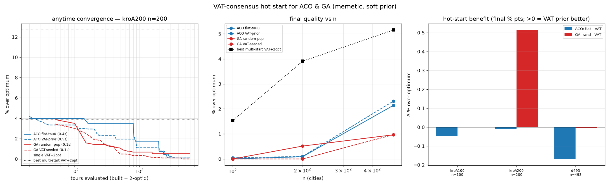

# ACO & GA hot-started from the VAT consensus (soft prior)

The end of the thread. The multi-start VAT consensus `C[a,b]` (fraction of starts
in which a,b are consecutive) is used as a **soft prior** — the 2-opt benchmark
ruled out hard-freezing it. Two memetic metaheuristics, each standard-init vs
VAT-hot-start, under the **same evaluation budget** (tours built + 2-opt'd), on
nearest-size EUC_2D TSPLIB. Source: `experiments/vat_tsp_aco_ga.py`.

- **ACO** (Ant Colony System, 2-opt on every ant): initial pheromone
  `tau0(a,b) = base·(1 + kappa·C[a,b])` (kappa=5) vs flat `tau0`.
- **GA** (order crossover OX, 2-opt on every child): seed the initial population
  with the per-start VAT orders vs an all-random population.

## Results (% over published optimum; all runs < 2 s)

| instance | n | single VAT+2opt | best multi-VAT+2opt | ACO flat | ACO VAT | GA rand | GA VAT |
|----------|------|-----------------|---------------------|----------|---------|---------|--------|
| kroA100 | 100 | +4.9% | +1.5% | +0.00% | +0.05% | +0.00% | +0.00% |
| kroA200 | 200 | +12.7% | +3.9% | +0.09% | +0.10% | +0.51% | **+0.00%** |
| d493 | 493 | +6.1% | +5.2% | +2.14% | +2.31% | +0.97% | +0.97% |

## Findings

1. **The memetic metaheuristics are the real win — over 2-opt, not over each
   other.** With full 2-opt inside every ant/child, ACO and GA reach **+0–2.3%**
   over optimum across n=100–500, far below plain VAT+2-opt (single +4.9…+12.7%,
   even best-of-24-starts +1.5…+5.2%). The population/colony diversity escapes the
   single-2-opt basins that plateaued at +8–22% in `VAT_TSP_2OPT_BENCH_FINDINGS.md`.

2. **The VAT consensus hot start helps mainly two ways:**
   - **Faster early (anytime) convergence** (panel a): the VAT-seeded curves
     (dashed) lead their standard-init counterparts through most of the budget on
     kroA200 — the prior gets the search into good territory sooner.
   - **GA population seeding gives a real final win on the harder mid instance**
     (kroA200 GA +0.51% → **+0.00%**). Seeding the population with genuinely
     different VAT orders injects useful, diverse building blocks.

3. **For final quality it is otherwise neutral** (panel c): ACO flat vs VAT ties
   within noise (sometimes flat is marginally better), and on kroA100/d493 the GA
   also ties. **Why:** once a strong local search (full 2-opt) runs on every
   solution, both inits converge to near-optimal within the budget, so the prior
   has little final-quality headroom. This is exactly the prior-art expectation —
   a better start mostly buys *speed*, not a better optimum, under strong local
   search (Johnson–McGeoch 1997); and MST-seeded ACO pheromone already exists
   (Dai et al. 2009), so no novelty is claimed here either.

## Verdict / recommendation

Use the VAT consensus as a **GA population seed** (clear early-convergence gain,
and a real final win on the harder instance) and as an **ACO `tau0` bias** (faster
early convergence). Do **not** expect it to lower the final optimum once memetic
2-opt is in play — the local search dominates. The honest headline is that the
*metaheuristic + 2-opt* is what reaches near-optimal; the VAT hot start is a
useful accelerator and a good GA seed, not a quality multiplier.

## Files
- `experiments/vat_tsp_aco_ga.py`, `experiments/figures/vat_tsp_aco_ga.png`.
- `aco_run` (ACS, memetic), `ga_run` (OX + 2-opt, memetic), `build_consensus`;
  reuses `two_opt_only` / `vat_order_nb` from `vat_tsp_2opt_bench.py`.
