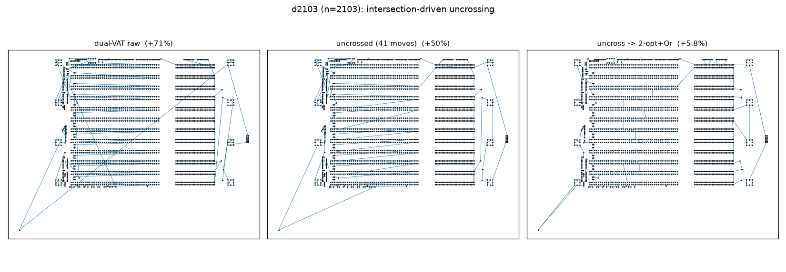

# Intersection-driven uncrossing 2-opt (cross-system)

For a 2-D euclidean tour, **crossing edges are the signature of sub-optimality**
(an optimal euclidean tour has none), so this strategy attacks them directly
instead of scanning the whole 2-opt neighbourhood blindly:

1. take the **longest** tour edge;
2. find every edge that **geometrically intersects** it — the crossing test is
   GPU-vectorised: one long edge vs all *n* edges at once, via the orientation
   (cross-product) segment-intersection test;
3. for each crossing edge apply the **2-opt move that removes the crossing** (for
   a proper crossing this is always improving — the triangle inequality) — i.e.
   "split the long edge and its intersecting edges and re-2-opt them";
4. repeat over the **top-k longest** edges (k=16) and loop until none of the top-k
   crosses anything.

Cross-system: the O(k·n) crossing detection runs on the GPU, the 2-opt reversals
on the host. From the dual-VAT raw tour, on nearest-size TSPLIB instances
(EUC_2D, fp32, reference = published optimum). Source:
`experiments/vat_tsp_cross.py`.

## Results (% over optimum)

| instance | n | raw | uncross-only | moves | t_cross | 2-opt+Or-opt | **uncross → 2-opt+Or-opt** |
|----------|------|------|--------------|-------|---------|--------------|----------------------------|
| kroA200 | 200 | +75% | +37.2% | 35 | — | +5.7% | **+5.0%** |
| d493 | 493 | +107% | +41.8% | 57 | 0.09 s | +6.0% | **+4.3%** |
| pr1002 | 1 002 | +92% | +42.4% | 95 | 0.24 s | +7.0% | **+5.9%** |
| d2103 | 2 103 | +71% | +49.6% | 41 | 0.07 s | +13.3% | **+5.8%** |
| fnl4461 | 4 461 | +240% | +56.3% | 539 | 0.63 s | **+4.9%** | +5.8% |

(First-instance timing includes numba JIT warm-up; steady-state 0.07–0.63 s.)

## Findings

- **The uncrossing pre-pass makes the *combination* the best local search here.**
  `uncross → 2-opt+Or-opt` beats plain 2-opt+Or-opt on 4 of 5 instances, and the
  win is large where plain 2-opt struggled most: **d2103 +13.3% → +5.8%** (more
  than halved), d493 +6.0→+4.3%, pr1002 +7.0→+5.9%, kroA200 +5.7→+5.0%. Breaking
  the longest crossings first drops the tour into a **much better 2-opt basin** —
  exactly the "break the largest intersection lines" intuition, confirmed.
- **Standalone it is only a coarse cleaner** (+37…+56%): it only fixes crossings
  of the top-16 *longest* edges and stops there, so many short-edge crossings and
  all non-crossing 2-opt gains remain. Its job is to remove the few
  catastrophic long diagonals (see the figure: the raw tour's long diagonals are
  gone after 41 moves), not to finish the tour.
- **Cheap and GPU-scalable.** The crossing test is one vectorised orientation
  pass per long edge (O(n) on the device); the whole pre-pass is 35–539 moves and
  <0.7 s through n=4461. The one regression (fnl4461) is a basin effect on a
  heavily-clustered instance — the greedy uncross order landed 2-opt in a slightly
  worse basin there.

## Verdict

**Run the intersection-driven uncrossing pre-pass before 2-opt+Or-opt.** It is a
cheap, GPU-friendly way to kill the dual-VAT tour's worst long-edge crossings and
consistently reach a better final tour — the standout being d2103 (+13.3% →
+5.8%). It complements, rather than replaces, the neighbour 2-opt: uncross the big
diagonals, then let 2-opt+Or-opt finish.

## Files
- `experiments/vat_tsp_cross.py`
- `experiments/figures/vat_tsp_cross.png` (quality vs n),
  `experiments/figures/vat_tsp_cross_tour.png` (d2103 raw → uncrossed → polished).
- Kernels: `crossing_2opt`, `_crossers_device` (GPU orientation test).
