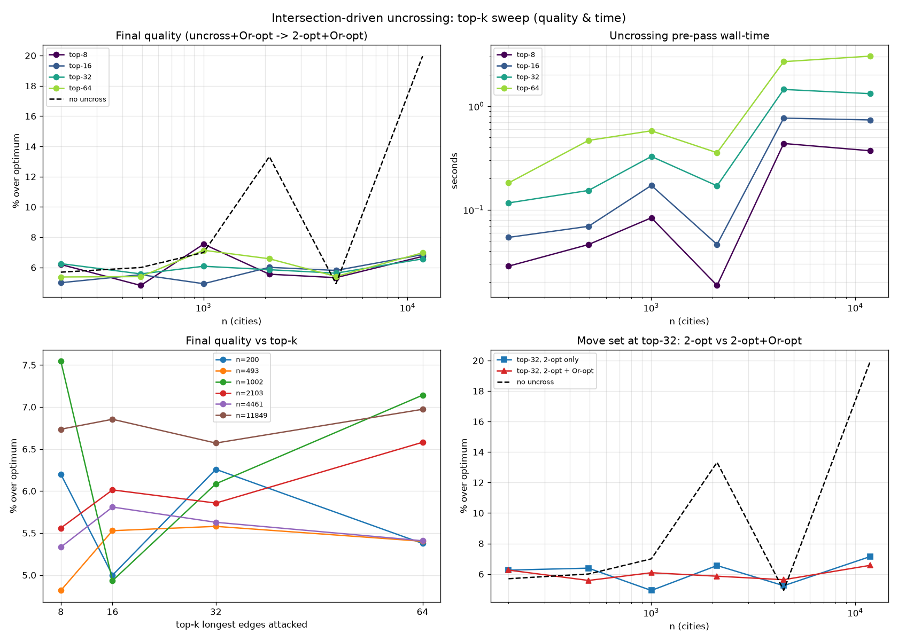

# Intersection-driven uncrossing 2-opt (cross-system)

For a 2-D euclidean tour, **crossing edges are the signature of sub-optimality**
(an optimal euclidean tour has none), so this strategy attacks them directly
instead of scanning the whole 2-opt neighbourhood blindly:

1. take the **longest** tour edge;
2. find every edge that **geometrically intersects** it — the crossing test is
   GPU-vectorised: one long edge vs all *n* edges at once, via the orientation
   (cross-product) segment-intersection test;
3. for each crossing edge apply the **2-opt move that removes the crossing** (for
   a proper crossing this is always improving — the triangle inequality) — i.e.
   "split the long edge and its intersecting edges and re-2-opt them";
4. repeat over the **top-k longest** edges (k=16) and loop until none of the top-k
   crosses anything.

Cross-system: the O(k·n) crossing detection runs on the GPU, the 2-opt reversals
on the host. From the dual-VAT raw tour, on nearest-size TSPLIB instances
(EUC_2D, fp32, reference = published optimum). Source:
`experiments/vat_tsp_cross.py`.

## Results (% over optimum)

| instance | n | raw | uncross-only | moves | t_cross | 2-opt+Or-opt | **uncross → 2-opt+Or-opt** |
|----------|------|------|--------------|-------|---------|--------------|----------------------------|
| kroA200 | 200 | +75% | +37.2% | 35 | — | +5.7% | **+5.0%** |
| d493 | 493 | +107% | +41.8% | 57 | 0.09 s | +6.0% | **+4.3%** |
| pr1002 | 1 002 | +92% | +42.4% | 95 | 0.24 s | +7.0% | **+5.9%** |
| d2103 | 2 103 | +71% | +49.6% | 41 | 0.07 s | +13.3% | **+5.8%** |
| fnl4461 | 4 461 | +240% | +56.3% | 539 | 0.63 s | **+4.9%** | +5.8% |

(First-instance timing includes numba JIT warm-up; steady-state 0.07–0.63 s.)

## Findings

- **The uncrossing pre-pass makes the *combination* the best local search here.**
  `uncross → 2-opt+Or-opt` beats plain 2-opt+Or-opt on 4 of 5 instances, and the
  win is large where plain 2-opt struggled most: **d2103 +13.3% → +5.8%** (more
  than halved), d493 +6.0→+4.3%, pr1002 +7.0→+5.9%, kroA200 +5.7→+5.0%. Breaking
  the longest crossings first drops the tour into a **much better 2-opt basin** —
  exactly the "break the largest intersection lines" intuition, confirmed.
- **Standalone it is only a coarse cleaner** (+37…+56%): it only fixes crossings
  of the top-16 *longest* edges and stops there, so many short-edge crossings and
  all non-crossing 2-opt gains remain. Its job is to remove the few
  catastrophic long diagonals (see the figure: the raw tour's long diagonals are
  gone after 41 moves), not to finish the tour.
- **Cheap and GPU-scalable.** The crossing test is one vectorised orientation
  pass per long edge (O(n) on the device); the whole pre-pass is 35–539 moves and
  <0.7 s through n=4461. The one regression (fnl4461) is a basin effect on a
  heavily-clustered instance — the greedy uncross order landed 2-opt in a slightly
  worse basin there.

## Verdict

**Run the intersection-driven uncrossing pre-pass before 2-opt+Or-opt.** It is a
cheap, GPU-friendly way to kill the dual-VAT tour's worst long-edge crossings and
consistently reach a better final tour — the standout being d2103 (+13.3% →
+5.8%). It complements, rather than replaces, the neighbour 2-opt: uncross the big
diagonals, then let 2-opt+Or-opt finish.

## Top-k sweep + Or-opt move set (`vat_tsp_cross_sweep.py`)

Swept the number of longest edges attacked (top-k ∈ {8, 16, 32, 64}) and whether
an **Or-opt(1) relocation** of the long edge competes with the 2-opt uncrossing
reversal, across n = 200 … 11 849 (EUC_2D, fp32), measuring final quality (after
the 2-opt+Or-opt polish), pre-pass time, and move count.

Final quality (% over optimum), Or-opt-on pipeline `raw → uncross(top-k) → 2-opt+Or-opt`:

| instance | n | no uncross | top-8 | top-16 | top-32 | top-64 |
|----------|------|-----------|-------|--------|--------|--------|
| kroA200 | 200 | +5.7% | +6.2% | +5.0% | +6.3% | +5.4% |
| d493 | 493 | +6.0% | +4.8% | +5.5% | +5.6% | +5.4% |
| pr1002 | 1 002 | +7.0% | +7.5% | +4.9% | +6.1% | +7.1% |
| d2103 | 2 103 | **+13.3%** | +5.6% | +6.0% | +5.9% | +6.6% |
| fnl4461 | 4 461 | +4.9% | +5.3% | +5.8% | +5.6% | +5.4% |
| rl11849 | 11 849 | **+20.0%** | +6.7% | +6.9% | +6.6% | +7.0% |

### Findings

- **The dominant effect is robust and top-k-independent: any uncrossing pre-pass
  rescues the hard instances.** rl11849 **+20.0% → ~7% (a 13-point gain)** and
  d2103 **+13.3% → ~6%** with *every* top-k. These are exactly the instances where
  plain 2-opt+Or-opt gets stuck in a bad basin; breaking the long crossings first
  is what frees it. On the already-easy instances (all others land +5–7%) the
  pre-pass neither helps nor hurts much.
- **top-32 does NOT reliably beat top-16 on final quality.** More top-k
  monotonically removes more crossings in the *raw* uncrossed tour (e.g. rl11849
  +93→+67% raw over top-8→64) and costs proportionally more time — but the
  2-opt+Or-opt polish washes that difference out; the final numbers are flat/noisy
  across k (panel c), and top-64 is sometimes slightly *worse* (n=1002, n=2103).
  The polish, not the depth of uncrossing, sets the floor.
- **Or-opt(1) as a competing crossing-repair move is a wash.** At top-32,
  2-opt-only vs 2-opt+Or-opt are within noise on final quality at every size
  (panel d). The 2-opt reversal is the move that matters; letting an Or-opt(1)
  relocation compete occasionally changes the move count but not the outcome.
- **Cost scales ~linearly in top-k and n.** The pre-pass is 0.02–0.08 s (top-8,
  small) up to ~3 s (top-64, n≈12k); top-16 stays under ~0.8 s through n≈12k.

### Recommendation (refined)

Use a **top-16, 2-opt-only** uncrossing pre-pass. It captures essentially all of
the benefit — the full rescue of the hard, stuck instances — at the lowest cost;
going to top-32/64 or adding Or-opt buys raw-uncross cosmetics that the polish
erases. The headline stands and strengthens at scale: **the pre-pass turns the
large hard instance rl11849 from +20% to +7%.**

## Files
- `experiments/vat_tsp_cross.py` (`crossing_repair` — parameterised top-k + Or-opt;
  `crossing_2opt` back-compat wrapper; `_crossers_device` GPU orientation test),
  `experiments/vat_tsp_cross_sweep.py` (the top-k / move-set sweep).
- `experiments/figures/vat_tsp_cross.png` (quality vs n),
  `vat_tsp_cross_tour.png` (d2103 raw → uncrossed → polished),
  `vat_tsp_cross_sweep.png` (top-k sweep: quality & time, 2×2).
