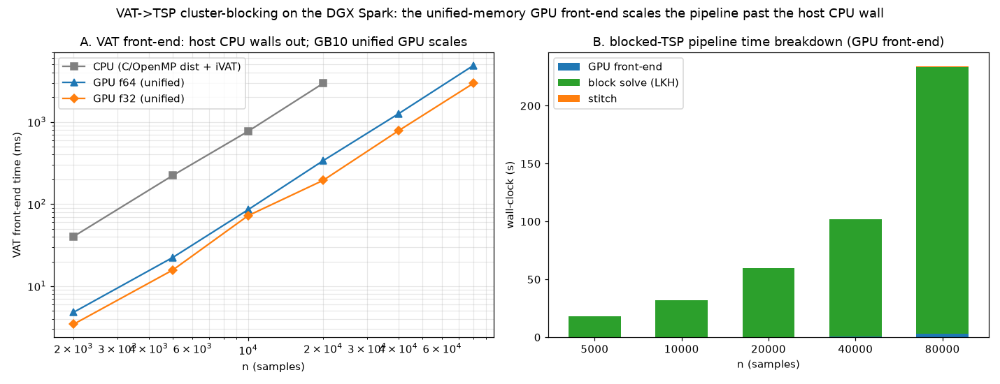
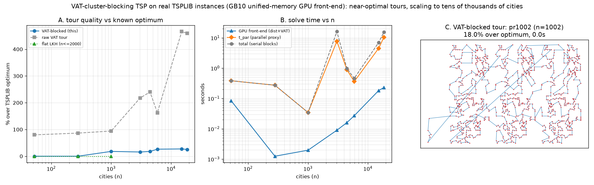

# VAT→TSP cluster-blocking at scale on the DGX Spark (GB10)

**Question:** how far does the VAT-cluster-blocking TSP solver
(`experiments/vat_tsp_benchmark.py`) scale, and what does the DGX Spark's
unified-memory GPU buy it?

**Setup:** GB10 (Grace-Blackwell, ~128 GB coherent unified memory), CuPy/CUDA
13, LKH via `elkai`. Two studies: synthetic blobs (`vat_tsp_dgx_scale.py`) and
real TSPLIB instances (`vat_tsp_tsplib.py`, submodule `experiments/tsplib`).

## The bottleneck is the O(n²) VAT front-end — and it moves to the GPU

The blocking solver is "cluster-first, route-second": build the VAT ordering,
cut it into blocks, solve each block (LKH), stitch. The per-block work is small
and parallel; the wall it hits at scale is the **O(n²) front-end** — the dense
`n×n` distance matrix plus the VAT ordering. On the host that walls out in memory
(the dense matrix) and time (the iVAT). On GB10 it runs on the device with the
matrix resident in the unified pool (`gpu_vat.vat_gpu`), returning only the O(n)
ordering.

**Front-end time (distances + VAT order), host CPU vs GB10 GPU:**

| n | CPU (C/OpenMP + iVAT) | GPU f64 | GPU f32 | order match f32 vs CPU |
|-------|-----------------------|---------|---------|------------------------|
| 5000 | 224 ms | 22 ms | 16 ms | 1.0000 |
| 10000 | 769 ms | 85 ms | 72 ms | 1.0000 |
| 20000 | 2955 ms | 338 ms | 195 ms | 0.9962 |
| 40000 | — (host wall) | 1255 ms | 779 ms | — |
| 80000 | — (host wall) | 4882 ms | 2957 ms | — |

The GPU front-end is ~15× the host at n=20000 and keeps going to n=80000 (a
25 GB f32 matrix in the unified pool) where the host is impractical. The f32
ordering is bit-identical to the CPU order up to n=10000 and within 0.4% of
positions at 20000 (near-tie flips only).

## End-to-end blocked TSP scales with a bounded parallel wall-clock

With the front-end on the GPU and the VAT order cut into **size-capped** blocks
(so every block stays LKH-solvable and the block solve is embarrassingly
parallel), the pipeline runs end-to-end on synthetic blobs to n=80000. Reporting
`t_par` = front-end + slowest single block + stitch (the parallel proxy, since
blocks solve independently):

| n | blocks | GPU front-end | t_par | serial total | tour vs raw VAT |
|-------|--------|---------------|-------|--------------|-----------------|
| 5000 | 14 | 0.01 s | 4.9 s | 18 s | −71% |
| 10000 | 31 | 0.05 s | 6.5 s | 32 s | −75% |
| 20000 | 64 | 0.17 s | 4.7 s | 60 s | −77% |
| 40000 | 130 | 0.72 s | 8.1 s | 102 s | −76% |
| 80000 | 262 | 2.71 s | 9.4 s | 234 s | −77% |

`t_par` stays ~5–9 s across a 16× range of n: the front-end is GPU-bounded and
each block is size-capped, so the only thing that grows is the *number* of
(independent, parallelizable) blocks. The serial total grows linearly — that is
the block solve, which is exactly the part designed to run in parallel.

## Real TSPLIB instances (52 → 18512 cities)

Same pipeline on real benchmark instances, with a **k-nearest-neighbour 2-opt
polish** whose candidate lists are computed from the resident GPU matrix
(another O(n²) step the unified pool absorbs). Tour lengths use TSPLIB's official
rounding, so the gap over the published optimum is exact.

| instance | n | % over optimum | raw VAT | t_par | total |
|----------|-------|----------------|---------|-------|-------|
| berlin52 | 52 | **0.0** | 80% | 0.4 s | 0.4 s |
| a280 | 280 | **0.0** | 86% | 0.3 s | 0.3 s |
| pr1002 | 1002 | 18.0 | 94% | 0.0 s | 0.0 s |
| pcb3038 | 3038 | 15.7 | 217% | 7.7 s | 16 s |
| fnl4461 | 4461 | 17.9 | 240% | 0.9 s | 1.0 s |
| rl5915 | 5915 | 26.2 | 163% | 0.4 s | 0.5 s |
| d15112 | 15112 | 27.3 | 466% | 4.5 s | 7 s |
| d18512 | 18512 | 25.3 | 460% | 10.4 s | 15 s |

- Small instances that fit one block are solved to the **optimum** (LKH).
- The blocking + kNN-2-opt polish turns the raw VAT closed tour (80–460% over
  optimum) into a **15–27%** tour at scale, with a bounded parallel wall-clock.
- This is a *fast approximate* result, not an LKH-quality one: solving blocks
  independently and stitching cannot recover the global structure LKH exploits,
  and the cheap 2-opt polish leaves a residual gap. Closing it (Or-opt / an LK
  move set on the resident kNN lists, or larger blocks) is the open direction.

## Limits observed

- **`pla*` VLSI instances (34k–86k, CEIL_2D, huge integer distances)** are the
  only TSPLIB instances above ~18k, and per-block LKH is impractically slow /
  unstable on them (elkai hangs). The synthetic study carries the scaling story
  past them instead.
- The **serial block solve** is the wall-clock cost at scale; the value of the
  design is that it is fully parallel (`t_par` is the real number). Genuine
  multi-GPU/multi-process block solving is untested here (the proxy is
  slowest-single-block).

## Files

- `experiments/vat_tsp_dgx_scale.py` — synthetic front-end + end-to-end scaling.
- `experiments/vat_tsp_tsplib.py` — real TSPLIB instances + kNN-2-opt polish.
- `experiments/tsplib/` — submodule (github.com/mastqe/tsplib).
- `experiments/figures/vat_tsp_dgx_scale.png`, `vat_tsp_tsplib.png`.
