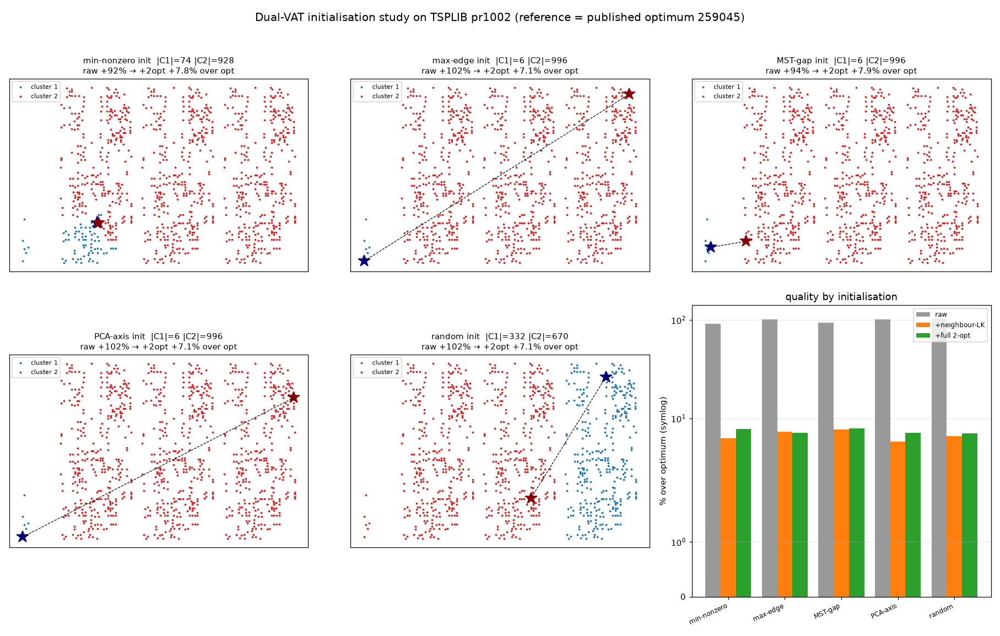
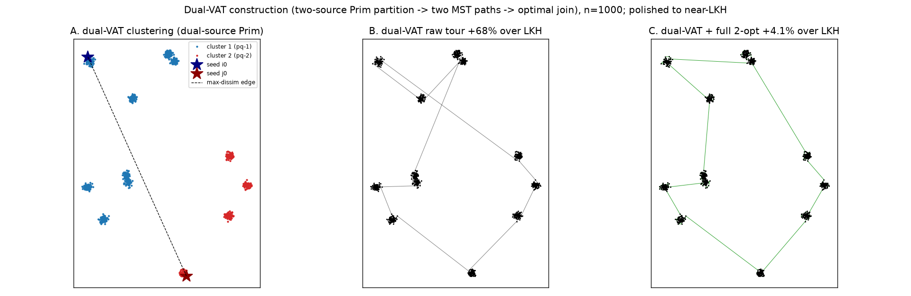

# A real LK step + dual-VAT construction (n=1000)

Two requested experiments. n=1000, 12 gaussian blobs, mean over 3 seeds, LKH
(`elkai`) reference. Source: `experiments/vat_tsp_dualvat_lk.py`.

## Update — min-non-zero-edge seeding, on TSPLIB reference data (pr1002)

Studied **five initialisation points** for the dual-source fronts, on the
repeatable TSPLIB instance nearest n=1000 (**pr1002**, dim 1002;
`nearest_euc_instance`). Reference = the **published optimum 259045** from the
submodule's `solutions` file (`optimal_length`) — no LKH; we care about *time to
near-optimal*.

| init | \|C1\| | \|C2\| | raw | + neighbour-LK (time) | + full 2-opt (time) |
|------|------|------|------|-----------------------|---------------------|
| min-non-zero edge | 74 | 928 | +92% | +6.3% (0.44 s) | +7.8% (0.06 s) |
| max edge | 6 | 996 | +102% | +7.3% (0.01 s) | +7.1% (0.03 s) |
| longest-MST-edge | 6 | 996 | +94% | +7.7% (0.02 s) | +7.9% (0.03 s) |
| PCA principal axis | 6 | 996 | +102% | **+5.9%** (0.02 s) | +7.1% (0.03 s) |
| random pair | 332 | 670 | +102% | +6.6% (0.01 s) | +7.1% (0.03 s) |

- **Initialisation barely affects the final tour.** After polishing, every seed
  lands within a tight **+5.9% to +7.9% over the optimum** (bar chart nearly
  flat) — the dual-VAT construction + local search converges to the same quality
  regardless of where the two fronts start. Best: PCA-axis (+5.9%) and
  min-non-zero (+6.3%) with the neighbour-LK. All in **under half a second**.
- **The 2-way partition is degenerate on a connected cloud.** pr1002 has no clean
  bimodal gap, so most seeds give a tiny pocket + "the rest" (6/996 for max,
  MST-gap and PCA; 74/928 for min). Only the **random** pair happened to land one
  seed in each half → a balanced 332/670. So partition balance is a property of
  the *data and seed placement*, not something these seed rules guarantee (on
  well-separated blobs the split is clean — see below).
- **The neighbour-list LK works well on this real instance** (~6-8%), unlike on
  the blob tours below (+22%): pr1002's fairly uniform layout has few long "jump"
  edges, so the neighbour-list moves suffice. Repeatable reference data gives the
  trustworthy picture.

(Five clustering images by initialisation + a quality bar chart; all reach
~6-8% over the published optimum after polish.)

## 2. Dual-VAT on synthetic blobs (original max-edge study — kept for the
## balanced-split illustration and the LK-vs-full-2opt finding)

- **2.1** pick the largest-dissimilarity pair (i0, j0);
- **2.2** seed cluster 1 at i0 (pq-1), cluster 2 at j0 (pq-2);
- **2.3** grow both single-linkage (Prim) fronts at once — at each step take the
  globally smallest frontier edge and let that city join whichever front reached
  it; each city ends in exactly one cluster (a dual-source MST partition);
- **2.4** each cluster's *assignment order* is its VAT path (Prim insertion
  order); join the two paths into one closed tour by the **optimal conjunction**
  — exhaustive over the 4 endpoint pairings/orientations (the seed pair from 2.1
  is one fixed junction; the other junction is optimised).

The dual-source partition is a clean spatial 2-way split — each blob goes wholly
to the nearer seed, cut along the max-dissimilarity edge (see figure panel A,
the requested clustering image).

**As a TSP suggestion** (mean % over LKH):

| stage | over LKH |
|-------|----------|
| dual-VAT raw closed tour | +76.6% |
| dual-VAT + neighbour-LK | +22.3% |
| **dual-VAT + full 2-opt** | **+5.3%** |
| (compare) NN + full 2-opt | +3.7% |

The raw dual-VAT tour is a VAT-quality path pair (~+77%, the usual VAT
closed-tour cost); polished with a full best-improvement 2-opt it reaches +5.3%
over LKH — a **sound construction**, competitive with (slightly behind) nearest-
neighbour as a 2-opt starting point. The two-junction "optimal conjunction"
replaces the single long wrap edge a single-VAT closed tour would carry.

(A: dual-source clustering. B: raw dual-VAT tour, +68%. C: after full 2-opt,
+4.1% over LKH.)

## 1. The LK step — and why the candidate list is the catch

Implemented an LK-family local search (`lk_search`): full neighbour-list 2-opt
(best improvement — my earlier `neighbor_two_opt` skipped the j<i half of the
neighbourhood, the bug that stalled it at 16-23%) plus Or-opt (relocate segments
of length 1-3), run to convergence.

**Finding: on VAT-structured tours the neighbour-list LK converges to markedly
weaker optima than a full O(n²) 2-opt.**

| start | + neighbour-LK | + full best-improvement 2-opt |
|-------|----------------|-------------------------------|
| dual-VAT | +22.3% | +5.3% |
| nearest-neighbour | +11.6% | +3.7% |

The reason is structural: VAT/dual-VAT tours carry a few long "jump" edges (where
Prim leapt to a far branch). Repairing one needs a move whose *new* edges connect
cities that are **not** in each other's k-nearest-neighbour list — exactly the
moves a candidate-list search never tries. The full 2-opt scans all pairs and
finds them, reaching +3.7-5.3%; the neighbour-list LK (k=16) cannot and stalls.
Neighbour-list local search is the right tool on *already-good* tours (few long
edges) and for scaling (O(n·k)); it is a poor finisher for VAT-jump tours, where
the O(n²) 2-opt — which does not scale — is the effective local optimiser.

**Takeaway.** (a) Dual-VAT is a valid, clean 2-way construction that polishes to
~+5% over LKH. (b) A true LK win at scale needs the *variable-depth sequential*
LK move (whose gain chain reaches beyond the immediate neighbour list), not the
fixed 2-opt+Or-opt neighbourhood implemented here — that is the remaining lever
for closing the gap at scale.

## Files
- `experiments/vat_tsp_dualvat_lk.py` — `dual_vat(seed_mode='min'|'max')` /
  `dual_vat_tour`, `lk_search`; runs on TSPLIB reference data
  (`nearest_euc_instance`).
- `experiments/figures/vat_tsp_dualvat_seed.png` (min-vs-max seed on pr1002),
  `vat_tsp_dualvat_lk.png` (original blob study).
