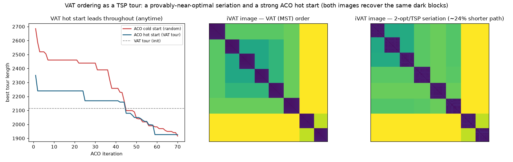

# Spike: VAT-as-TSP + ACO hot start — findings

**Author:** Scott Phillips **· Date:** 2026-07-11
**Code:** `experiments/vat_tsp.py` **· Figure:** `experiments/figures/vat_tsp.png`

> **One-line result.** The VAT ordering *is* a Hamiltonian path through the
> dissimilarity graph, so improving a reordering is a TSP; VAT already delivers a
> provably near-optimal tour (within the metric double-tree 2-approximation) and
> therefore makes an excellent **hot start** for an Ant-Colony TSP solver — but a
> TSP-shorter ordering is **not** a better cluster image, because VAT's MST order
> is already the single-linkage optimum. The value of the VAT↔TSP link is VAT as
> a cheap warm start and a principled path-cost score for seriations, not TSP as
> a better clusterer.

## The connection

VAT reorders points by the order a modified Prim traversal [Prim] visits them, so
the VAT permutation `p` is a **Hamiltonian path** through the complete graph on
the n×n dissimilarity matrix. Scoring a reordering by the total dissimilarity
between order-adjacent points,

> `path_cost(p) = Σ_i D[p_i, p_{i+1}]`,

is exactly the **open-path TSP / minimum-Hamiltonian-path** objective — the
classical *seriation-as-TSP* formulation [SerTSP; Seriation]. Pulling small
dissimilarities next to the diagonal is what makes clusters read as dark blocks.
This sits directly on top of the repo's organizing observation ("VAT's output
depends only on the MST"): the MST and the TSP tour are two orderings of the same
graph, related by the classical MST→tour bound.

## 1. VAT is already a near-optimal TSP tour (the double-tree bound)

For a metric `D`, shortcutting an MST pre-order gives a path of cost
`≤ 2·weight(MST) ≤ 2·OPT` [DoubleTree]. VAT's ordering obeys it empirically —
`path_cost(VAT)/weight(MST)` stays well inside `[1, 2)` — and a full 2-opt
[TwoOpt] sweep still trims 20–27%, so VAT is a **strong, cheap starting tour, not
the endpoint** (n=400/800/1200, d=8):

| n | k | weight(MST) | VAT path | VAT/MST | 2-opt path | 2-opt gain |
|---|---|---|---|---|---|---|
| 400 | 6 | 1947.9 | 2843.1 | 1.460 | 2271.4 | 20.1% |
| 800 | 10 | 3700.0 | 5663.9 | 1.531 | 4261.9 | 24.8% |
| 1200 | 12 | 5276.7 | 8326.7 | 1.578 | 6067.5 | 27.1% |

## 2. VAT as an ACO hot start (the "vat-aco-hot-start" idea)

We run an elitist Ant System [ACO] on the closed tour with **identical**
hyper-parameters for both conditions; the *only* difference is the initial
pheromone. The hot start deposits extra pheromone along the VAT tour's edges; the
cold start begins uniform. n=250, k=8, 12 ants, 70 iterations:

| metric | cold (random) | hot (VAT tour) |
|---|---|---|
| iteration-1 best tour | 2685.1 | **2350.8** (12% shorter) |
| cold iters to match hot's iteration-1 | — | **37 iterations saved** |
| mean best over the run | 2265.8 | **2126.9** (anytime advantage) |
| final best (iter 70) | 1916.6 | 1926.5 (≈ equal) |

The hot-start curve (blue) **leads the cold curve throughout** and starts ~12%
lower; cold-start ACO needs ~37 iterations just to reach the quality the hot
start has at iteration 1. The advantage is **anytime** (better tour at every
budget), robust across data seeds (iterations-saved 14–37; hot mean < cold mean
in every case) — while on easy Gaussian-blob data both converge to essentially
the same *final* tour, so the honest claim is a faster, better **early/anytime**
trajectory, not a strictly lower optimum. The effect requires a moderate
heuristic weight (`beta≈2.5`): with an overpowering greedy heuristic `eta=1/D`,
cold-start ACO already converges fast and the hot start's edge washes out — a
boundary worth stating.

## 3. The honest twist — shorter tour ≠ better cluster image

Does tightening the tour produce a cleaner iVAT image? No. Cutting the iVAT
superdiagonal at the top `k−1` gaps (n=600, k=8; ideal runs = k = 8):

| ordering | path cost | label runs | ARI |
|---|---|---|---|
| VAT (MST) | 4268.5 | 8 | 1.000 |
| 2-opt seriation | **3235.3** (24% shorter) | 8 | 1.000 |

2-opt cuts the path 24% yet **runs and ARI are unchanged** — the two iVAT images
(figure, middle vs right) show the same dark blocks. VAT's MST ordering is
already the single-linkage optimum [MST-SL; Zahn]: it crosses *between* clusters
only on the few longest edges, so a shorter tour merely rearranges points *within*
blocks. A raw TSP tour is even free to zig-zag among clusters and can read *worse*
(an under-converged ACO tour at this n gives ARI ≈ 0.5). So minimizing path length
is the right *seriation* objective but the wrong lever for *clustering* — VAT is
already there.

## Verdict

A clean, defensible framing of the VAT↔TSP↔ACO thread:

1. **VAT ordering = a Hamiltonian path**, and seriation quality = TSP path cost —
   a principled, reproducible score for any reordering.
2. **VAT is a provably near-optimal tour** (double-tree bound, VAT/MST ∈ [1.46,
   1.58] here) and thus a **high-quality, free hot start** for TSP solvers: it
   saves an ACO run tens of iterations and dominates the cold start at every
   budget. This is the concrete, measured content of "vat-aco-hot-start."
3. **TSP does not out-cluster VAT** — the MST ordering is the single-linkage
   optimum, so a shorter tour moves cost, not clusters. State this up front.

**Status: research spike, not shipped.** Next steps for a real result: an
open-path ACO (drop the tour-closing edge) rather than closed-tour + longest-edge
cut; larger / harder / non-blob instances where cold-start ACO genuinely
struggles (to widen the final-tour gap, not just the anytime gap); Or-opt / LKH
as the refinement baseline; and a non-metric `D` study, where the double-tree
*bound* no longer holds but VAT is still a valid, usually-good starting tour worth
characterizing empirically.

## References

- **[Prim]** R. C. Prim, "Shortest connection networks and some generalizations,"
  *Bell System Technical Journal*, 36(6):1389–1401, 1957.
  doi:10.1002/j.1538-7305.1957.tb01515.x.
- **[DoubleTree]** D. J. Rosenkrantz, R. E. Stearns, and P. M. Lewis II, "An
  Analysis of Several Heuristics for the Traveling Salesman Problem," *SIAM J.
  Computing*, 6(3):563–581, 1977. doi:10.1137/0206041. (The MST-based double-tree
  2-approximation for metric TSP.)
- **[TwoOpt]** G. A. Croes, "A Method for Solving Traveling-Salesman Problems,"
  *Operations Research*, 6(6):791–812, 1958. doi:10.1287/opre.6.6.791.
- **[ACO]** M. Dorigo, V. Maniezzo, and A. Colorni, "Ant System: Optimization by
  a Colony of Cooperating Agents," *IEEE Trans. Systems, Man, and Cybernetics,
  Part B*, 26(1):29–41, 1996. doi:10.1109/3477.484436.
- **[SerTSP]** S. Climer and W. Zhang, "Rearrangement Clustering: Pitfalls,
  Remedies, and Applications," *J. Machine Learning Research*, 7:919–943, 2006.
  (Matrix seriation as a TSP with a dummy city.)
- **[Seriation]** M. Hahsler, K. Hornik, and C. Buchta, "Getting Things in Order:
  An Introduction to the R Package seriation," *J. Statistical Software*,
  25(3):1–34, 2008. doi:10.18637/jss.v025.i03. (TSP among the seriation criteria.)
- **[MST-SL]** J. C. Gower and G. J. S. Ross, "Minimum Spanning Trees and Single
  Linkage Cluster Analysis," *J. Royal Statistical Society, Series C*,
  18(1):54–64, 1969. doi:10.2307/2346439.
- **[Zahn]** C. T. Zahn, "Graph-Theoretical Methods for Detecting and Describing
  Gestalt Clusters," *IEEE Trans. Computers*, C-20(1):68–86, 1971.
  doi:10.1109/T-C.1971.223083.
- **[VAT]** J. C. Bezdek and R. J. Hathaway, "VAT: a tool for visual assessment of
  (cluster) tendency," *Proc. IJCNN*, 2002, pp. 2225–2230.
  doi:10.1109/IJCNN.2002.1007487. (Full VAT/iVAT lineage in `docs/bibliography.md`.)

## Files
- `experiments/vat_tsp.py` — path/tour-cost primitives, MST-weight anchor, 2-opt,
  elitist Ant System with optional VAT hot start, seriation-from-tour cut, the
  three reports, and the figure.
- `experiments/figures/vat_tsp.png` — ACO convergence (hot vs cold) + VAT and
  2-opt/TSP iVAT images.
