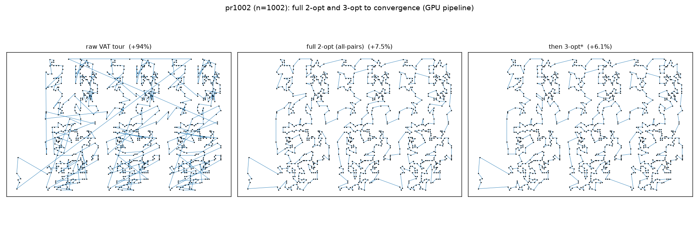

# Full 2-opt & 3-opt to convergence (GPU pipeline) — n=1000 first

"Full round … until no new moves are made" = run each operator **uncapped**,
looping until a complete sweep makes **zero** improving moves (a true local
optimum). From the VAT tour on the GPU-built distance matrix / kNN; quality =
% over published optimum. Escalation raw → 2-opt* → 3-opt*. Source:
`experiments/vat_tsp_kopt.py`.

**3-opt correctness:** the neighbour-list 3-opt uses a *recipe* whose delta and
its application are the same construction (order ∈ {BC,CB} × reverse-B × reverse-C,
7 reconnections). Self-tested vs brute force — 300 random tours × 7 reconnections,
asserting the applied tour length equals `L0 − gain` exactly (nint). Passes.

## Results — n=1000 (pr1002, published optimum 259 045)

| stage | quality | time | sweeps / moves |
|-------|---------|------|----------------|
| raw VAT tour | +94.03% | — | — |
| 2-opt* (neighbour-list, k=10) | +16.35% | <0.001 s | 7 sweeps, 633 moves |
| **2-opt (GPU all-pairs, exact)** | **+7.51%** | 0.023 s | 324 moves (1/pass) |
| 3-opt* (from neighbour-list 2-opt) | +12.53% | 0.001 s | 3 sweeps, 96 moves |
| **3-opt* (from full 2-opt)** | **+6.09%** | 0.001 s | 4 sweeps, 48 moves |

All runs **converged** (final sweep made 0 moves).

## Findings

1. **The escalation works when the neighbourhood is held fixed.** Full (all-pairs)
   2-opt reaches +7.51%; running 3-opt to convergence on top drops it to **+6.09%**
   — 3-opt ⊇ 2-opt, so it strictly improves. Likewise the neighbour-list 2-opt
   (+16.35%) is improved by neighbour-list 3-opt (+12.53%).
2. **The k-NN candidate list caps quality — and by a lot here.** Neighbour-list
   2-opt (+16.35%) is far worse than exact all-pairs 2-opt (+7.51%), and even the
   neighbour-list *3-opt* (+12.53%) can't catch the exact *2-opt*. Reason: the raw
   VAT tour's cost is dominated by long **seam** edges between clusters; breaking
   them needs a partner that is spatially far (not in the k=10 nearest-neighbour
   set), so the neighbour-list operators can't touch them. The all-pairs
   neighbourhood can — this is the same long-seam effect the
   intersection-driven uncrossing study exploited (`VAT_TSP_CROSS_FINDINGS.md`).
3. **Timing at n=1000 is trivial**: neighbour-list sweeps are sub-millisecond;
   the exact all-pairs 2-opt is 0.023 s (324 sequential one-move passes); full
   2-opt→3-opt ≈ 0.024 s end-to-end.

## Scaling note (before the 18k run)

- **Exact all-pairs 2-opt does *not* scale to 18k as written**: it applies one
  move per pass, each pass an O(n²) GPU kernel → ~O(n³) overall (324 passes
  already at n=1000; moves grow with n). That is minutes-to-hours at 18k.
- **The neighbour-list operators scale** (O(n·k) per sweep) but are quality-capped
  by the seam problem above.
- **To get both quality and scale at 18k**, pair the neighbour-list 2-opt/3-opt
  with the **long-edge / uncrossing pre-pass** already built
  (`vat_tsp_cross.py`) — it breaks exactly the long seams the k-NN set misses —
  or use a many-moves-per-sweep GPU 2-opt. This is the recommended 18k path.

## Files
- `experiments/vat_tsp_kopt.py`, `experiments/figures/vat_tsp_kopt_pr1002.png`.
- `two_opt_converge`, `three_opt_converge` (+ `_dnew_code`/`_apply3` recipe,
  `_selftest`); exact GPU 2-opt via `vat_tsp_reslice.gpu_two_opt` (float64 matrix).
- Run other sizes: `python -m experiments.vat_tsp_kopt <n>`.
