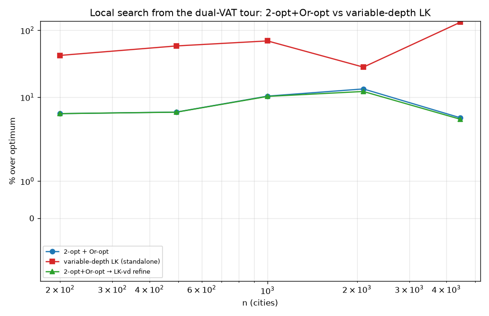

# Variable-depth Lin-Kernighan vs 2-opt+Or-opt (local search)

Added a **variable-depth sequential Lin-Kernighan** move (`lk_search_vd` in
`vat_tsp_dualvat_lk.py`): from each anchored city, a chain of reverse-suffix
2-opt steps under the cumulative positive-gain criterion, arbitrary depth,
keeping the best-improving prefix. Compared against the existing neighbour-list
2-opt+Or-opt (`lk_search`), both starting from the dual-VAT raw tour, on
nearest-size TSPLIB instances (fp32, reference = published optimum). Source:
`experiments/vat_tsp_lk.py`.

## Results (% over optimum)

| instance | n | raw | 2-opt+Or-opt | LK-vd (standalone) | 2-opt+Or-opt → LK-vd |
|----------|------|------|--------------|--------------------|----------------------|
| kroA200 | 200 | +75% | **+5.7%** | +42.2% | +5.7% |
| d493 | 493 | +107% | **+6.0%** | +58.5% | +6.0% |
| dsj1000 | 1 000 | +148% | +10.4% | +69.5% | **+10.3%** |
| d2103 | 2 103 | +71% | +13.3% | +28.2% | **+12.2%** |
| fnl4461 | 4 461 | +240% | +4.9% | +132.2% | **+4.7%** |

## Findings (honest)

- **Standalone, this variable-depth LK is weak** (+28 … +132% over optimum) —
  well behind the 2-opt+Or-opt neighbourhood (+4.9 … +13.3%). The reason is
  structural: the move anchors a city and only ever performs *reverse-suffix*
  2-opt steps from that anchor, taking the **first** positive-gain neighbour in a
  **single** tour direction with **no backtracking**. That is a much narrower
  move set than full neighbour 2-opt (which scans all near-neighbour edge pairs)
  and it converges to poor local optima.
- **As a refinement stage after 2-opt+Or-opt it helps slightly** — the deep
  chains occasionally find moves the 2-opt neighbourhood misses: d2103
  +13.3→+12.2%, fnl4461 +4.9→+4.7%, dsj1000 +10.4→+10.3%. Small but consistent
  and cheap (LK-vd is ~0–0.9 s here).
- **A competitive standalone LK is a large build.** Matching LKH needs the full
  Lin-Kernighan-Helsgaun machinery — *both* tour directions from t1, breadth /
  backtracking at the first levels, the α-nearness candidate set, don't-look
  bits, and interleaved Or-opt — which is precisely why LKH is a substantial C
  codebase. This repo already gets that gold standard through the **`elkai`
  (LKH)** binding, used as the per-block solver in the cluster-blocking pipeline.

## Practical recommendation

For the VAT→TSP pipeline: use **2-opt+Or-opt** as the fast, scalable local search
(the resident-kNN neighbour lists make it O(n·k)); optionally run **LK-vd as a
cheap post-polish** for a small extra shave; and use **`elkai`/LKH** when
gold-standard sub-tours are wanted (small blocks). The from-scratch variable
-depth LK is included and correct, but is not a substitute for LKH without the
full backtracking machinery.

## Files
- `experiments/vat_tsp_lk.py`, `experiments/figures/vat_tsp_lk.png`.
- LK move: `vat_tsp_dualvat_lk.lk_search_vd` (+ `_lk_city`, `_reverse_suffix`).
