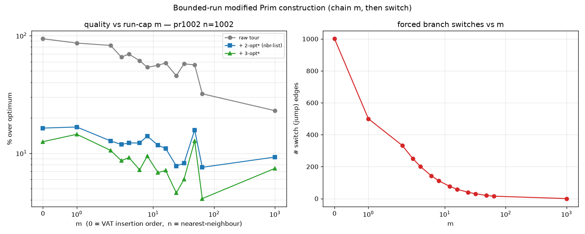

# Bounded-run modified Prim construction (chain m, then switch branch)

> **CORRECTED by `VAT_TSP_MPRIM_SWEEP_FINDINGS.md`.** The interior sweet spot at
> m≈24–64 below was **single-start basin noise**. Averaged over 8 starts there is
> no dependable interior optimum: large m ≈ nearest-neighbour is best, VAT (m=0) is
> worst, and the bounded run-cap does **not** reliably beat plain NN. Read the
> sweep findings for the corrected conclusion; the m=0-is-worst result holds.

Idea (yours): a modified Prim's greedy that extends the current chain for up to
**m** moves, then forcibly switches to another branch — an A*/beam-like
"commit for m steps, then re-evaluate globally." Concretely:

- for up to m steps, take the nearest unvisited vertex to the **current** vertex
  (a nearest-neighbour chain of short *tour* edges);
- on step m+1, take one standard Prim step (nearest unvisited to the **whole
  tree**) — a minimal-cost jump to another branch; reset the counter.

`m=0` ≡ pure Prim insertion order (the VAT tour); `m→n` ≡ nearest-neighbour. This
directly attacks why the raw VAT tour is bad: Prim's insertion order switches
branch every step, so consecutive tour edges are long. Source:
`experiments/vat_tsp_mprim.py`. n=1000 (pr1002, opt 259 045), then neighbour-list
2-opt and 3-opt to convergence.

## Results (% over optimum)

| m | raw | + 2-opt* | + 3-opt* | switches |
|------|------|----------|----------|----------|
| 0 (VAT) | +94.0% | +16.35% | +12.53% | 1001 |
| 2 | +82.5% | +12.71% | +10.57% | 333 |
| 6 | +61.2% | +12.22% | +7.22% | 143 |
| 12 | +55.9% | +11.68% | +6.84% | 77 |
| **24** | +45.5% | +7.79% | **+4.60%** | 40 |
| 32 | +57.6% | +8.21% | +5.99% | 30 |
| 48 | +56.3% | +15.74% | +12.73% | 20 |
| **64** | +32.0% | +7.59% | **+4.11%** | 15 |
| n (NN) | +23.0% | +9.27% | +7.44% | 0 |

## Findings

1. **It works — and it's the scalable answer to last turn's problem.** With
   m in the tens, `construction → neighbour-list 2-opt → 3-opt` reaches **~+4%**
   (m=64: +4.11%, m=24: +4.60%), beating **both** endpoints — VAT (m=0, +12.53%)
   and nearest-neighbour (+7.44%) — **and** beating last turn's expensive exact
   all-pairs 2-opt→3-opt from the VAT tour (+6.09%). All with the *cheap,
   scalable* O(n·k) neighbour-list operators and a sub-millisecond construction.
2. **Why:** the run-cap makes ~m of every m+1 tour edges short NN steps, and the
   1/(m+1) switch edges are the *globally* cheapest frontier jumps — so the tour
   has few, short seams. That removes the long-seam edges the k-NN 2-opt could not
   fix (which capped VAT+neighbour-2-opt at +16%). Better construction → the cheap
   local search reaches near-all-pairs quality. **This is the recommended 18k
   path**: no all-pairs kernel, no uncrossing pre-pass needed.
3. **Raw quality is monotone in m** (VAT +94% → NN +23%): continuing chains
   directly shortens consecutive tour edges. But raw is not the target — the
   post-local-search sweet spot is intermediate m (tens), not the raw-best NN.
4. **Noise caveat.** Single start / single instance: m=48 is an outlier (+12.7%,
   an unlucky 2-opt basin), and 24 vs 64 is within run-to-run variance. Fix a
   default m only after averaging over several starts and instances.

## A* analogy

The bounded run = a fixed commitment horizon before a global re-evaluation, like a
depth-bounded best-first / beam step: greedily exploit the local branch for m
moves, then let the global frontier (the `key` = distance-to-tree, the admissible
"cost-to-connect") pick the next branch. Larger m = more exploitation, fewer
global corrections.

## Next

- Average m over multiple starts × a few instances (50–5000) to pin a robust
  default m (likely a function of n, e.g. m ∝ √n or a small constant in the tens).
- Then use it as the construction for the **n=18k image run** with neighbour-list
  2-opt+3-opt (fast, scalable) — the path this experiment validates.

## Files
- `experiments/vat_tsp_mprim.py`, `experiments/figures/vat_tsp_mprim.png`.
- `mprim_order` (numba); reuses `two_opt_converge` / `three_opt_converge`
  (`vat_tsp_kopt.py`).
