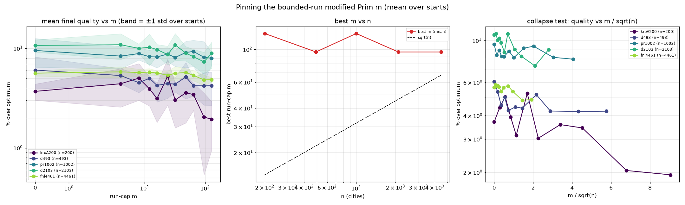

# Pinning the run-cap m (averaged over starts) — and a correction

Followed `VAT_TSP_MPRIM_FINDINGS.md` (single start, noisy) by averaging the FINAL
quality (bounded-Prim construction → neighbour-list 2-opt → 3-opt, all to
convergence) over **8 starts per instance**, across n=200–4461. % over published
optimum. Source: `experiments/vat_tsp_mprim_sweep.py`.

## Mean final quality (% over optimum), per m

| instance | n | VAT m=0 | m=16 | m=32 | m=64 | m=96 | m=128 | NN |
|----------|------|---------|------|------|------|------|-------|------|
| kroA200 | 200 | 3.7 | 3.1 | 3.0 | 3.4 | 2.0 | **1.9** | 2.1 |
| d493 | 493 | 6.1 | 4.3 | 4.4 | 4.2 | 4.2 | 4.2 | 4.5 |
| pr1002 | 1002 | 9.5 | 8.2 | 8.1 | 9.3 | 8.1 | 8.0 | **7.6** |
| d2103 | 2103 | 10.7 | 9.7 | 10.8 | 8.2 | **7.3** | 8.9 | 6.2 |
| fnl4461 | 4461 | 5.6 | 5.7 | 5.6 | 5.4 | **4.8** | 4.9 | 4.9 |

(std over starts ≈ 0.6–1.8 pts.)

## Findings

1. **VAT insertion order (m=0) is robustly the worst construction** — confirmed on
   every instance. That part of the earlier result holds: do not use Prim's raw
   insertion order as the tour.
2. **There is no robust interior sweet spot.** Averaged over starts, mean final
   quality falls ~monotonically toward large m and flattens; the best finite m is
   **large (96–128), i.e. effectively nearest-neighbour**, and pure NN is as good
   or better on 2 of 5 instances (pr1002, d2103). The `best m vs n` panel shows
   ~constant 96–128, **not √n** (the collapse test on m/√n does not collapse).
3. **The bounded run-cap does not reliably beat plain nearest-neighbour.** Where
   large-m wins it wins by ~0.1–0.5 pt (within the ±0.6–1.8 pt start-to-start
   std); where NN wins (pr1002, d2103) it wins outright.

## Correction to VAT_TSP_MPRIM_FINDINGS.md

That single-start run reported an interior optimum at m≈24–64 (n=1000: m=64 →
+4.11%, "beating NN +7.4%"). **Averaged over 8 starts that does not hold** — the
m=64 mean for pr1002 is **+9.3%** (worse than NN's +7.6%); the +4.11% was one lucky
start / 2-opt basin. The honest conclusion is the weaker one: **large m ≈ NN is
best, VAT is worst, and there is no dependable interior m.** The bounded-run idea's
real content is "use NN-style long chains, not VAT insertion order" — it does not
add a reliable win over nearest-neighbour itself.

## Practical takeaway for the 18k path

Use **nearest-neighbour construction → neighbour-list 2-opt + 3-opt** (to
convergence). It is the simplest form, matches or beats every bounded-m setting on
average, and keeps the whole pipeline O(n·k) + sub-ms construction — the scalable
route that still lands ~2–8% over optimum depending on instance (vs +55…+94% for
the raw VAT tour). Because start-to-start variance (±0.6–1.8 pt) exceeds the m
effect, **multi-start NN + take-best is a better use of budget than tuning m.**

## Files
- `experiments/vat_tsp_mprim_sweep.py`, `experiments/figures/vat_tsp_mprim_sweep.png`.
