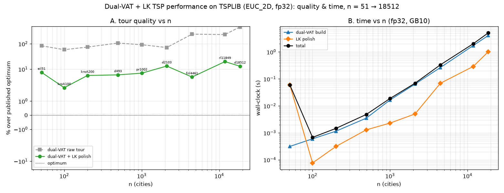

# Dual-VAT + LK TSP — performance report (quality & time, fp32)

Sweep 50 → 50000 target cities on the GB10, **fp32**, distances resident on the
device. Method: **dual-VAT construction (min-non-zero seed) → neighbour-list LK
polish** (2-opt + Or-opt, candidates from the resident-matrix kNN). Reference =
the **published TSPLIB optimum** (from the submodule `solutions` file — no LKH).
Repeatable data: each target resolves to its nearest-size **EUC_2D** instance.
Source: `experiments/vat_tsp_perf_report.py`.

> The largest EUC_2D instance is **d18512** (18,512 cities), so the 20000 and
> 50000 targets both resolve to it — euclidean TSPLIB has nothing near 50k, so
> the euclidean sweep tops out at ~18.5k.

## Results

| instance | n | optimum | raw % | **final %** | build s | polish s | **total s** |
|----------|------|---------|-------|-------------|---------|----------|-------------|
| eil51 | 51 | 426 | +84% | +7.5% | 0.00 | 0.06\* | 0.06 |
| kroA100 | 100 | 21 282 | +59% | **+2.0%** | 0.00 | 0.00 | 0.00 |
| kroA200 | 200 | 29 368 | +75% | +5.7% | 0.00 | 0.00 | 0.00 |
| d493 | 493 | 35 002 | +107% | +6.0% | 0.00 | 0.00 | 0.00 |
| pr1002 | 1 002 | 259 045 | +92% | +7.0% | 0.02 | 0.00 | 0.02 |
| d2103 | 2 103 | 80 450 | +71% | +13.3% | 0.06 | 0.01 | 0.07 |
| fnl4461 | 4 461 | 182 566 | +240% | +4.9% | 0.26 | 0.07 | 0.33 |
| rl11849 | 11 849 | 923 288 | +231% | +20.0% | 1.73 | 0.29 | 2.02 |
| d18512 | 18 512 | 645 238 | +462% | +13.1% | 4.07 | 1.02 | **5.09** |

\* first call includes numba JIT compilation (one-time).

## Quality

- The LK polish takes the raw dual-VAT tour (**+59% … +462%** over optimum) down
  to **+2.0% … +20.0%** — a fast approximate solver, not an LKH-close one.
- Quality is **instance-dependent, not monotone in n**: structured instances
  polish well (kroA100 +2.0%, fnl4461 +4.9%), while hard near-uniform ones are
  worse (d2103 +13.3%, rl11849 +20.0%, d18512 +13.1%). This tracks the
  neighbour-list LK's known weakness on tours with long "jump" edges — the
  quality ceiling here is the **local search**, not the construction.

## Time (fp32, GB10)

- **Total ≤ 5.1 s to n = 18 512**; sub-second through n ≈ 5000.
- Dominated by the **dual-VAT build**, an O(n²) host single-linkage growth
  (4.07 s at 18.5k). The **LK polish** is cheaper and scales ~O(n·k) (kNN on the
  resident fp32 matrix + neighbour-list moves): ≤ 1.02 s at 18.5k.
- fp32 halves the resident matrix and the host copy vs f64 at no measured quality
  cost on these instances.

## Limits / levers

- **Reaching true 50k** needs either a CEIL_2D `pla*` instance (34k–86k) or,
  better, a **GPU dual-VAT build** — the host O(n²) single-linkage growth is the
  wall-clock bottleneck; the sequential dual-Prim can run on the resident matrix
  with cupy to push past ~18k.
- **Beating ~5-20%** needs a stronger scalable local search — a true
  variable-depth sequential LK move (gain chain beyond the fixed neighbour list),
  which is the outstanding lever from the LK-step study.

## Files
- `experiments/vat_tsp_perf_report.py`
- `experiments/figures/vat_tsp_perf_report.png`
