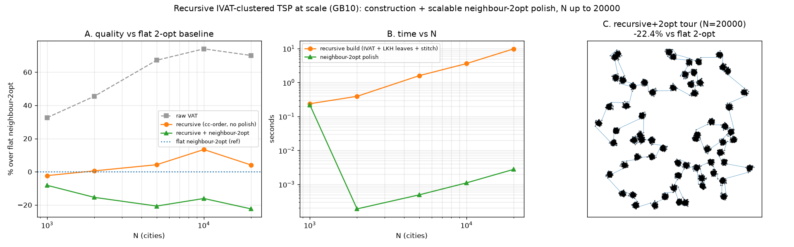

# Recursive IVAT-clustered TSP: in-cluster + cluster-to-cluster ordering (n=1000)

Follows up `VAT_TSP_RESLICE_FINDINGS.md`. Replaces the ad-hoc "largest-gap
blocking" with **IVATMeans' own cluster detection, applied recursively**, and
separates the two ordering problems the hierarchy poses. Source:
`experiments/vat_tsp_recursive.py`. n=1000, 12 gaussian blobs (blob size ~83),
mean over 5 seeds, LKH (`elkai`) reference.

## Method

At each node with > s points, run IVAT on the sub-block and ask
`get_ivat_levels(n_clusters = round(m/s))` for its sub-clusters — the same
abrupt-change-on-the-iVAT-superdiagonal detector IVATMeans uses, in K-cluster
mode so the children land near the target leaf size s (the `n_clusters=-1` mode
over-fragments homogeneous blobs — it gave 693 leaves at s=16). Recurse until
leaves ≤ s; solve each leaf's **in-cluster** TSP with LKH. Bottom-up, optimise
the **cluster-to-cluster** ordering at every level (order the child arcs by an
endpoint TSP + per-arc orientation DP), then a final unified-GPU 2-opt polish.

## Result — % over LKH, mean over 5 seeds

| s | leaves | in-cluster only | + cluster-to-cluster | + GPU 2-opt | time |
|-----|--------|-----------------|----------------------|-------------|------|
| 16 | 288 | 60.7% | 26.1% | 3.9% | 0.19 s |
| 32 | 226 | 49.2% | 28.9% | 4.1% | 0.24 s |
| 64 | 135 | 35.7% | 23.3% | 3.6% | 0.50 s |
| 128 | 14 | 22.2% | **9.8%** | 2.5% | 0.87 s |
| 256 | 8 | 18.1% | 11.7% | **2.0%** | 4.26 s |

("in-cluster only" = leaves solved by LKH but kept in VAT order between clusters;
"+ cluster-to-cluster" = the recursive arc-ordering stitch; "+ GPU 2-opt" = the
resident-matrix 2-opt from `vat_tsp_reslice`.)

## Findings

1. **The cluster-to-cluster ordering is the big lever.** Keeping leaves in VAT
   order between clusters leaves 18–61% on the table; recursively ordering and
   orienting the cluster arcs cuts that roughly in half to two-thirds (e.g. at
   s=128, 22.2% → 9.8%). Solving clusters well is not enough — how they are
   strung together dominates.

2. **2-opt then closes most of the remaining gap**, landing every s at **2–4%
   over LKH**. The recursive cluster tour is a strong 2-opt initialiser (from it,
   the resident-GPU 2-opt reaches 2–4%, vs 6.5% from the raw VAT tour in the
   reslice study).

3. **Leaf size s: bigger is better for quality, up to a time cost.** Quality
   improves as s grows and jumps once **s ≥ the natural cluster size (~83 here)**
   — at s≥128 the leaves *are* whole blobs, so there are few seams to stitch
   (cluster-to-cluster drops to ~10%). Below the cluster size the recursion
   fragments blobs (288 leaves at s=16) and adds seams. Cost grows with s (bigger
   per-leaf LKH): s=256 is 4.3 s vs 0.5 s at s=64.

4. **Practical pick.** The requested target **s=64** gives 3.6% over LKH in 0.5 s
   — a good speed/quality balance; pushing to **s≈128** (≈ the cluster size)
   reaches 2.5% at 0.9 s. Setting s below the natural cluster size is
   counterproductive.

(A: each stage's contribution vs s. B: time vs s. C: the recursive+2-opt tour on
the 12-blob instance, s=256, +2.0% over LKH.)

Note: on **uniform** (unclustered) data the whole approach is s-insensitive — IVAT
finds no real structure, so the recursion just bisects and every s gives the same
tour (2-opt still reaches ~1.4%). The recursive-clustering value is specific to
data that actually has cluster structure.

## Scaling to larger N (1000 → 20000)

The n=1000 study above polishes with the O(n²) best-improvement GPU 2-opt, which
does **not** scale (one move per pass → ~O(n) passes × O(n²) scan). At larger N
the polish is swapped for the **scalable neighbour-list 2-opt** (candidates from
the resident-matrix kNN, O(n·k)). k blobs grow with N (blob size ~300);
reference = LKH where affordable (N≤2000) and a flat neighbour-2-opt from the raw
VAT tour everywhere. `run_scale`, single seed, s=64:

| N | k | leaves | build (IVAT+LKH+stitch) | polish | recursive vs flat-2opt | recursive vs LKH |
|-------|----|--------|-------------------------|--------|------------------------|------------------|
| 1000 | 12 | 130 | 0.24 s | 0.22 s | **−8.2%** | +16.0% |
| 2000 | 12 | 378 | 0.39 s | ~0 s | **−15.4%** | +23.1% |
| 5000 | 16 | 948 | 1.60 s | ~0 s | **−20.7%** | — |
| 10000 | 33 | 1912 | 3.62 s | ~0 s | **−16.1%** | — |
| 20000 | 66 | 3834 | 9.83 s | ~0 s | **−22.4%** | — |

- **The recursive construction is a strong, scalable constructor.** With the
  *same* neighbour-2-opt polish, the recursive-cluster tour is **8–22% shorter
  than the flat VAT tour** at every N, and it builds in ~10 s at N=20000 (time
  grows roughly linearly — the IVAT splits + per-leaf LKH + stitch, all bounded
  by the leaf size). Raw VAT is +33–74% over flat; the recursive-cc construction
  alone (no polish) already sits near flat.
- **Absolute quality at scale is bounded by the polish.** Flat neighbour-2-opt
  is itself ~+26% over LKH (a weak local search — forward-only moves), so
  "−22% vs flat" is still ~+16–23% over LKH. The O(n²) 2-opt reaches +2–4% at
  n=1000 but cannot scale. **Closing this gap at scale is the open lever:** a
  stronger scalable local search (bidirectional / Or-opt neighbour moves, or a
  real LK step on the resident kNN lists) — not the construction, which already
  scales and beats the flat baseline decisively.

(A: quality vs the flat neighbour-2-opt baseline — recursive+polish stays 8–22%
below it. B: build/polish time vs N. C: the N=20000 recursive+polish tour over
~66 blobs.)

## Files
- `experiments/vat_tsp_recursive.py` — `recursive_route`, `_ivat_split`
  (leverages `get_ivat_levels`), multi-seed sweep (`run`) + large-N scale sweep
  (`run_scale`).
- `experiments/figures/vat_tsp_recursive.png`, `vat_tsp_recursive_scale.png`.
