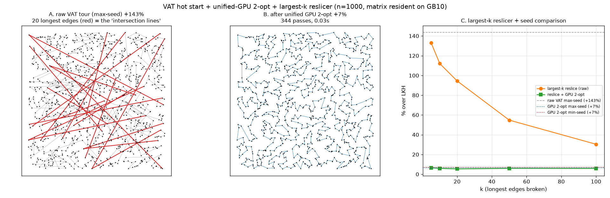

# VAT hot-start seed, unified-GPU 2-opt, and a largest-k reslicer (n=1000)

Single n=1000 uniform-2D instance on the DGX Spark GB10 (distance matrix
resident in unified memory). LKH (`elkai`, runs=5) reference tour = 23015.
Source: `experiments/vat_tsp_reslice.py`.

## 1. VAT hot-start seed: smallest-nonzero vs largest dissimilarity

VAT classically seeds its ordering at the **global-max** dissimilarity vertex.
Seeding at the **smallest non-zero** dissimilarity instead (a dense-core point)
makes essentially no difference as a TSP hot start:

| seed | raw closed VAT | after GPU 2-opt |
|------|----------------|-----------------|
| max-dissimilarity (classic) | 56041 (+143.5%) | 24515 (**+6.5%**) |
| min-nonzero dissimilarity | 55931 (+143.0%) | 24644 (+7.1%) |

The raw hot-start length is within 0.4% either way, and after local optimisation
the classic max-seed is marginally better (6.5% vs 7.1%). **Verdict: the seed
choice is not a meaningful lever** for hot-start quality here — the raw VAT
*closed* tour cost is dominated by the single-linkage path structure and the one
long wrap edge, not by where the traversal starts.

## 2. Unified GPU 2-opt (LKH-style local-opt core)

A best-improvement 2-opt as a CuPy RawKernel that reads the resident matrix
directly (`gpu_two_opt`): one move per pass, an O(n²) delta scan on the GPU each
pass, the reversal applied on-device — only one scalar move descriptor crosses
to the host per pass. It takes the +143% raw VAT tour to **+6.5% over LKH in 344
passes / 0.03 s**, and finds a better local optimum than the host first-
improvement 2-opt (best- vs first-improvement: −4% on a control instance). The
tour never leaves the device.

(A: raw VAT tour, 20 longest edges in red — the "intersection lines". B: after
the unified GPU 2-opt — the long crossings are gone.)

## 3. Largest-k reslicer — breaking the longest intersection lines

Cut the **k longest edges** of the closed tour into k arcs, then reconnect the
arcs optimally (endpoint TSP over the 2k arc-ends + a per-arc orientation DP).
This is a targeted k-opt whose cost is set by k, not n — it spends effort only on
the worst edges. Applied to the raw VAT tour:

| k | reslice alone | reslice + GPU 2-opt | reslice time |
|-----|---------------|---------------------|--------------|
| 5 | +133.0% | +6.4% | 0.001 s |
| 10 | +112.0% | +5.9% | 0.001 s |
| 20 | +94.4% | **+5.4%** | 0.003 s |
| 50 | +54.8% | +5.9% | 0.013 s |
| 100 | +30.3% | +5.8% | 0.081 s |

- **Reslicing alone** monotonically shrinks the gap as k grows (breaking more of
  the long edges), from +133% (k=5) to +30% (k=100) — cheaply (≤0.08 s), because
  it only re-routes the k worst edges.
- As a **pre-step before 2-opt** it is a small but real win: reslice(k=20) +
  GPU 2-opt reaches **+5.4%**, beating plain GPU 2-opt (+6.5%) — breaking the
  worst edges first drops the tour into a better 2-opt basin. Diminishing past
  k≈20 (2-opt cleans up the rest regardless).

**Takeaway:** the efficient recipe for "break the largest intersection lines" is
largest-k reslice with small k (~20) as a warm-up, then the unified GPU 2-opt —
together ~+5.4% over LKH in well under 0.1 s, entirely on the resident matrix.

## Files
- `experiments/vat_tsp_reslice.py` — seeds, `gpu_two_opt`, `largest_k_reslice`.
- `experiments/figures/vat_tsp_reslice.png`.
