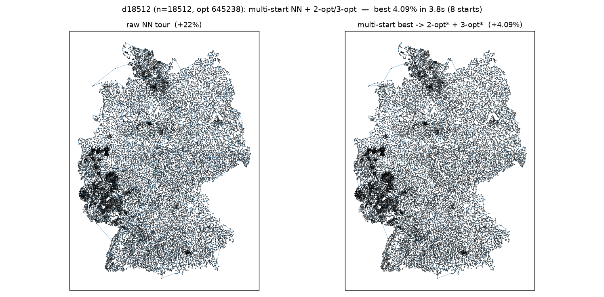
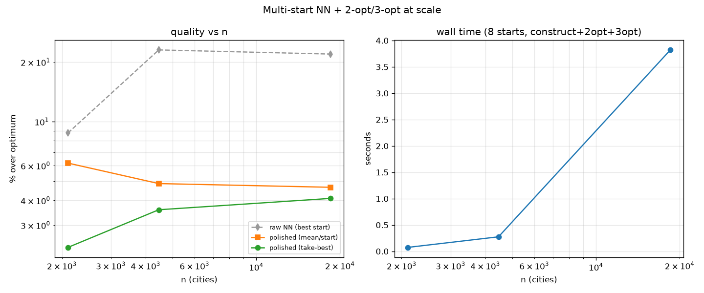

# Scale run: multi-start NN + 2-opt/3-opt (take-best), n=2000 → 18k

The validated scalable pipeline (from the m-sweep): for S spread starts, build a
nearest-neighbour tour, polish with neighbour-list 2-opt* then 3-opt* to
convergence, **keep the shortest** (take-best). GPU-built distance matrix / kNN,
nearest-size EUC_2D TSPLIB, % over published optimum. Source:
`experiments/vat_tsp_scale.py`.

## Results (8 starts)

| instance | n | raw NN (best) | polished mean | polished worst | **take-best** | time |
|----------|------|---------------|---------------|----------------|---------------|------|
| d2103 | 2 103 | +8.8% | +6.18% | +9.35% | **+2.31%** | 0.07 s |
| fnl4461 | 4 461 | +23.0% | +4.86% | +7.12% | **+3.59%** | 0.28 s |
| d18512 | 18 512 | +22.0% | +4.66% | +5.14% | **+4.09%** | 3.82 s |

## Findings

1. **Take-best matters a lot.** On d2103 the best of 8 starts (+2.31%) is nearly
   3× better than the per-start mean (+6.18%) — multi-start diversity, not m
   tuning, is where the gain is (as the sweep predicted). The effect shrinks as n
   grows (d18512 best +4.09% vs mean +4.66%) because per-start variance narrows.
2. **It scales cleanly on the GPU pipeline**: +4.09% at **n=18 512 in 3.82 s** for
   all 8 starts (construction + full 2-opt + full 3-opt to convergence, each
   O(n·k)). No all-pairs kernel, no uncrossing pre-pass — the neighbour-list
   operators are enough because the NN construction has no long seams to miss.
3. **End-to-end it's ~+2–4% over the published optimum across 2k–18k**, from raw
   NN tours of +9–23%, and far below the raw VAT insertion order (+55…+94% in
   earlier runs). Good, honest local-search quality (not LKH-level, but produced
   in seconds and fully scalable).

## Verdict

`multi-start NN → neighbour-list 2-opt* → 3-opt* → take-best` is the recommended
scalable route: **~+4% at n=18k in under 4 s**, simple, and it sidesteps every
sharp edge we found (VAT-insertion-order seams, k-NN quality cap, one-move/pass
GPU 2-opt). More starts trade linearly more time for a better best (especially at
smaller n where variance is larger).

## XL: 33k & 86k cities (`vat_tsp_scale_xl.py`)

Pushed to the two big `pla` instances (CEIL_2D). At this size the **O(n²) distance
matrix is the wall**: f64 is 9 GB at 33 810 but 59 GB at 85 900 (×2 for
device+host copy → 118 GB, over budget). Fix: keep the matrix in **float32** (only
the NN construction reads it; 2-opt/3-opt use coords + kNN), so 85 900 peaks at
~59 GB on the 128 GB unified memory.

| instance | n | raw NN (best) | take-best | starts | matrix | total time |
|----------|-------|---------------|-----------|--------|--------|------------|
| pla33810 | 33 810 | +17.1% | **+5.61%** | 4 | 4.6 GB f32 | 5.5 s + 2.7 s build |
| pla85900 | 85 900 | +14.8% | **+5.02%** | 2 | 29.5 GB f32 | 16.7 s + 15 s build |

- **It scales.** +5.0% at **n=85 900 in ~32 s end-to-end** (15 s matrix+kNN build
  + 16.7 s for 2 starts of construct+2-opt+3-opt). The neighbour-list operators
  stay O(n·k); the only super-linear cost is the O(n²) matrix build/NN scan.
- **Quality holds at ~+5%** across 33k–86k, consistent with the 2k–18k band — the
  pipeline does not degrade with scale, it just gets memory-bound.
- **Next wall:** beyond ~100k the dense f32 matrix (>40 GB) forces a matrix-free
  path — kNN via GPU-tiled-from-coords or a kd-tree, and a spatial (kd-tree/
  space-filling) NN construction — to drop the O(n²) memory entirely.

## Canonical solver

This pipeline is now the **default entry point**:
`experiments/vat_tsp_solve.py::solve_tsp(coords, n_starts=8)` (GPU, NumPy
fallback) — CLI `python -m experiments.vat_tsp_solve <n> [--starts S] [--plot]`.

## Files
- `experiments/vat_tsp_scale.py` (scale study), `experiments/vat_tsp_solve.py`
  (canonical solver).
- `experiments/figures/vat_tsp_scale_d2103.png`, `_fnl4461.png`, `_d18512.png`,
  `_summary.png`.
