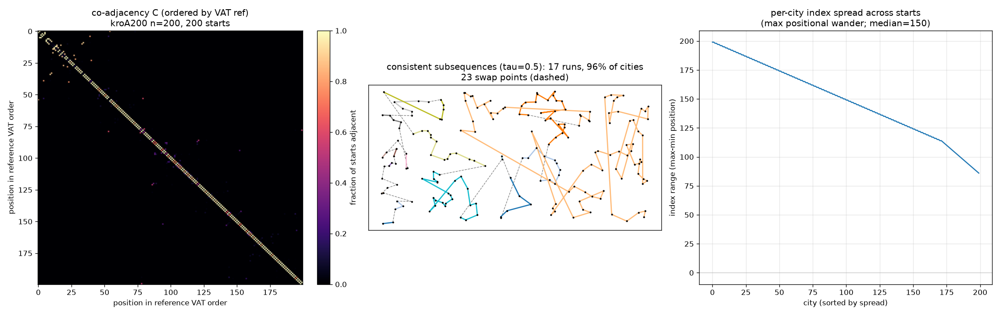
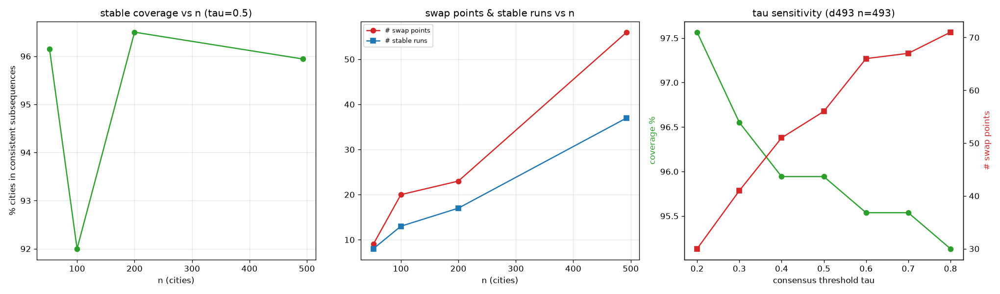

# VAT sequence variation & consensus — swap points for 2-opt (pre-ACO/GA)

**Question (this step).** Run the VAT ordering from many different starting cities
on a small instance (n = 50–500), see how the sequences change, and use the
variation to identify **consistent subsequences** (stable building blocks) and the
**swap points** where a 2-opt should act. The consensus this produces is the
hot-start prior for the ACO/GA step that follows.

**Setup.** VAT's order is Prim's insertion order over the MST; the MST is
start-independent (unique for distinct distances), so changing the start
*re-linearises the same tree*. We run the order from **every** start (all n for
n ≤ 256), then form the **co-adjacency matrix** `C[a,b]` = fraction of starts in
which a, b are consecutive. Along the canonical VAT reference order we cut into
runs wherever a consecutive link has `C < tau` (tau = 0.5): the runs are the
consistent subsequences; the cuts are the swap points. Nearest-size EUC_2D TSPLIB
instances, all distances exact. Source: `experiments/vat_tsp_seqvar.py`.

## Results

| instance | n | starts | coverage (stable) | # stable runs | # swap points | longest run | swap/stable edge-len |
|----------|------|--------|-------------------|---------------|---------------|-------------|----------------------|
| berlin52 | 52 | 52 | 96.2% | 8 | 9 | — | 0.9× |
| kroA100 | 100 | 100 | 92.0% | 13 | 20 | — | 2.1× |
| **kroA200** | **200** | **200** | **96.5%** | **17** | **23** | **79** | **2.0×** |
| d493 | 493 | 256 | 95.9% | 37 | 56 | — | 2.3× |

kroA200 detail: median per-city index spread across starts = **150 of 200**.

## Findings

1. **VAT ordering is locally stable but globally fluid.** ~92–96% of cities live
   in consistent subsequences that recur *regardless of the start*, yet each
   city's **absolute position wanders enormously** (median spread 150/200 — most
   cities can land almost anywhere in the sequence). The start does not reshuffle
   the building blocks; it **relocates and reverses** them. The co-adjacency
   heatmap shows this directly: a bright, unbroken super-/sub-diagonal (stable
   local adjacency) with a handful of dark breaks (the swap points) and faint
   off-diagonal specks (blocks that move as a unit).

2. **The swap points are the geometric seams — the long edges.** Low-consensus
   links are **~2× longer** than within-run links (kroA100 2.1×, kroA200 2.0×,
   d493 2.3×); on the point map they are exactly the dashed jumps *between*
   spatial clusters, while the coloured runs hug local geometry. This
   **independently rediscovers the same seams** the intersection-driven uncrossing
   study attacked as "the longest edges" (`VAT_TSP_CROSS_FINDINGS.md`) — two
   different analyses converging on the same flexible links. (berlin52 is too
   small for the geometric separation to show, hence its 0.9×.)

3. **This licenses a drastically reduced 2-opt.** Freeze the consistent
   subsequences and let 2-opt reconnect only at the swap points. The swap count
   scales at roughly **~0.1·n** (23 at n=200, 56 at n=493, growing ~linearly with
   #stable runs), so the candidate-cut set shrinks from O(n²) to O((0.1n)²) — about
   a **100× smaller neighbourhood** — targeted exactly where the ordering is
   ambiguous.

4. **Robust to the threshold.** Coverage stays 95.5–97.5% and swap count moves
   smoothly as tau sweeps 0.2→0.8 (panel c); tau = 0.5 is a safe middle. Coverage
   is also nearly n-independent (panel a).

> **Follow-up caveat (see `VAT_TSP_2OPT_BENCH_FINDINGS.md`).** Using the seams as
> a **hard** restriction on 2-opt (freeze the runs, only seam cities initiate) is a
> *net loss* at scale — full 2-opt is both faster end-to-end and far better,
> because the naive closed VAT tour needs global repair the restriction forbids.
> The consensus is valuable as a **soft prior** (below), not a hard freeze.

## The hot-start prior (hand-off to ACO/GA)

The co-adjacency matrix `C` is saved to
`experiments/figures/vat_tsp_seqvar_coadj_kroA200.npz` (with `ref`, `coords`). It
is a ready-made **consensus edge prior**:
- **ACO:** initialise pheromone `τ₀(a,b) ∝ C[a,b]` (consensus edges start hot),
  instead of a flat / NN-scaled τ₀.
- **GA:** treat the consistent subsequences as protected **building-block genes**;
  restrict crossover/mutation break-points to the swap points.
- **Reduced 2-opt / OR-opt:** restrict candidate cuts to the swap points.

## Honesty / prior art

Consensus/backbone edges across multiple constructions to guide local search is a
known idea (e.g. "A Consensus-Edge Initializer for Multi-start 2-opt on the
symmetric Euclidean TSP"; backbone-guided local search generally). What is
specific here is deriving the consensus from **multi-start VAT (single-linkage MST)
orderings** and using it both to define frozen subsequences and to seed the ACO/GA
prior. As with the rest of this thread, treat it as an applied composition, not a
novel mechanism.

## Files
- `experiments/vat_tsp_seqvar.py`
- `experiments/figures/vat_tsp_seqvar.png` (co-adjacency heatmap · consistent
  subsequences + swap points on the map · per-city position spread),
  `vat_tsp_seqvar_summary.png` (coverage/swaps vs n · tau sensitivity).
- `experiments/figures/vat_tsp_seqvar_coadj_kroA200.npz` (consensus prior for ACO/GA).
