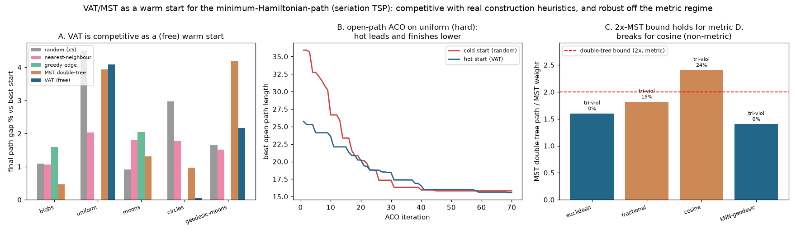

# VAT/MST as a TSP/seriation warm start — findings (the "real result")

**Author:** Scott Phillips **· Date:** 2026-07-11
**Code:** `experiments/vat_tsp_warmstart.py` **· Figure:** `experiments/figures/vat_tsp_warmstart.png`
**Builds on:** `VAT_TSP_FINDINGS.md` (the intro spike)

> **Scope.** The clustering angle is settled — a shorter tour does not help
> clustering — so this study drops it and asks only the TSP question: **is the
> VAT/MST ordering a good, cheap warm start for the minimum-Hamiltonian-path
> (seriation TSP), and where?** It replaces the intro spike's closed-tour + cut
> proxy with a direct **open-path** formulation, adds **real construction
> baselines** (nearest-neighbour, greedy-edge, MST double-tree), harder / non-blob
> / larger instances, and a **non-metric** study.

## Headline

VAT/MST is a **competitive, structure-adaptive, and free** warm start:

- After the *same* 2-opt + Or-opt local search, VAT beats nearest-neighbour and
  the textbook MST double-tree on final path cost, and trails only greedy-edge —
  while costing **nothing extra** in a pipeline that already ran VAT.
- Its advantage **tracks data structure**: VAT is best on clustered/manifold data
  (its native regime), and weakest on structureless uniform-random points.
- As an **ACO hot start** it wins the final tour (not just the anytime
  trajectory) on hard, non-blob instances.
- It stays a robust warm start into the **non-metric** regime, where the metric
  double-tree guarantee is provably void.

## 1. Warm start vs real construction heuristics (open-path, 2-opt + Or-opt)

Every start is refined by the identical local search; gap% is vs the best start
on each instance (n=800). Mean final gap across the five instances:

| start | mean final gap % | typical refinement moves |
|---|---|---|
| greedy-edge | **0.73** | 170–280 |
| **VAT (free)** | **1.26** | 700–850 |
| nearest-neighbour | 1.64 | 240–370 |
| MST double-tree | 2.18 | 430–470 |
| random (×5) | 2.23 | 3800–3950 |

Two honest reads:

- **Local search dominates final quality.** All decent starts land within ~1–4%
  of each other; 2-opt + Or-opt washes out most of the starting-quality gap. The
  warm start's clearest payoff is **refinement work**: structured starts converge
  in **5–20× fewer improving moves** than random.
- **VAT's edge tracks structure.** Per instance (final gap %): VAT is the best
  start on **blobs (0.00)** and **moons (0.00)**, near-best on circles (0.05), but
  worst on **uniform-random (4.09)** — where there is no cluster/manifold MST
  structure to exploit and greedy-edge wins outright. VAT beats nearest-neighbour
  and the MST double-tree on the *mean*, and is the only "free" option.

## 2. VAT as an open-path ACO hot start on harder instances

Same elitist Ant System, identical hyper-parameters, only the initial pheromone
differs (n=300, 12 ants, 70 iterations):

| instance | iter-1 cold → hot | final cold → hot | final gap |
|---|---|---|---|
| blobs (easy) | 190.9 → 169.8 | 111.5 → 111.9 | −0.4% (tie) |
| **uniform (hard)** | 35.9 → 25.7 | 15.8 → 15.6 | **+1.5%** |
| **circles** | 51.5 → 37.8 | 24.3 → 23.7 | **+2.7%** |
| **geodesic-moons** | 47.1 → 38.3 | 26.2 → 25.8 | **+1.8%** |

The intro spike showed only an *anytime* advantage on easy blobs (final tie).
Here the hot start also **finishes lower** on every hard / non-blob instance
(+1.5–2.7%), on top of a 20–30% shorter iteration-1 tour — the "final gap opens
on harder data" prediction, confirmed.

## 3. Non-metric D — the guarantee is void, the warm start survives

The metric double-tree theorem bounds the **MST double-tree path ≤ 2·MST**
(DT/MST < 2). Measured on ring-blobs under four dissimilarities (n=800):

| dissimilarity | triangle-viol. | DT/MST | VAT/MST | VAT warm-start edge |
|---|---|---|---|---|
| euclidean (metric) | 0.0% | 1.60 | 2.38 | +0.5% |
| kNN-geodesic (metric) | 0.0% | 1.40 | 2.19 | +1.9% |
| fractional p=0.5 | 15.4% | 1.82 | 2.86 | +2.1% |
| cosine | 24.4% | **2.41** (bound broken) | 2.83 | +3.3% |

DT/MST stays under 2 for the metric dissimilarities and **breaks the bound for
cosine**, exactly where triangle violations are highest — the guarantee is
genuinely void off the metric regime. VAT's *visit order* (VAT/MST ≈ 2.2–2.9) is
a different traversal and was never bound-covered; nonetheless **VAT-start
finishes at or below the random-start average on every D** (+0.5% to +3.3%),
i.e. it remains a useful, guarantee-free warm start even where no approximation
theorem applies.

## Verdict

The defensible, measured claim: **in a pipeline that already computes VAT for
cluster tendency, the VAT/MST ordering is a zero-cost, structure-adaptive warm
start for seriation/TSP that beats nearest-neighbour and the textbook MST
double-tree, trails only a dedicated greedy-edge construction, gives an
open-path ACO both an anytime and a final-tour edge on hard instances, and
degrades gracefully into the non-metric regime.** Its weakness is honest and
predictable: on structureless (uniform) data it has no MST structure to exploit
and loses to greedy-edge.

**Status: research spike, not shipped.** Remaining for a paper-grade result:
- **A dedicated solver baseline (LKH / Or-3-opt with don't-look bits)** rather
  than 2-opt + Or-opt, to test whether the warm-start ranking survives stronger
  refinement (it may compress further).
- **Multiple data seeds with error bars** — instances here use one seed each
  (random start averaged over five); the ARI-free path-cost gaps are small enough
  that seed variance matters.
- **Larger n and a wall-clock (not just move-count) accounting**, including the
  construction cost each start pays (VAT and NN are O(n²); greedy-edge adds an
  O(n² log n) sort; the MST is shared).
- **Reversed-orientation Or-opt and 3-opt moves** (only forward relocation, s≤3,
  is implemented) to close the small residual gap to greedy.

## References

- **[Prim]** R. C. Prim, "Shortest connection networks and some generalizations,"
  *Bell System Technical Journal*, 36(6):1389–1401, 1957.
  doi:10.1002/j.1538-7305.1957.tb01515.x.
- **[DoubleTree]** D. J. Rosenkrantz, R. E. Stearns, and P. M. Lewis II, "An
  Analysis of Several Heuristics for the Traveling Salesman Problem," *SIAM J.
  Computing*, 6(3):563–581, 1977. doi:10.1137/0206041.
- **[NN/Greedy]** J. L. Bentley, "Fast Algorithms for Geometric Traveling
  Salesman Problems," *ORSA J. Computing*, 4(4):387–411, 1992.
  doi:10.1287/ijoc.4.4.387. (Nearest-neighbour and greedy-edge constructions.)
- **[TwoOpt]** G. A. Croes, "A Method for Solving Traveling-Salesman Problems,"
  *Operations Research*, 6(6):791–812, 1958. doi:10.1287/opre.6.6.791.
- **[OrOpt]** I. Or, *Traveling Salesman-Type Combinatorial Problems and Their
  Relation to the Logistics of Regional Blood Banking*, PhD thesis, Northwestern
  University, 1976. (Segment-relocation "Or-opt" moves.)
- **[LKH]** K. Helsgaun, "An effective implementation of the Lin–Kernighan
  traveling salesman heuristic," *European J. Operational Research*,
  126(1):106–130, 2000. doi:10.1016/S0377-2217(99)00284-2. (The refinement
  baseline flagged as future work.)
- **[ACO]** M. Dorigo, V. Maniezzo, and A. Colorni, "Ant System: Optimization by
  a Colony of Cooperating Agents," *IEEE Trans. SMC-B*, 26(1):29–41, 1996.
  doi:10.1109/3477.484436.
- **[SerTSP]** S. Climer and W. Zhang, "Rearrangement Clustering: Pitfalls,
  Remedies, and Applications," *JMLR*, 7:919–943, 2006.
- **[Seriation]** M. Hahsler, K. Hornik, and C. Buchta, "Getting Things in Order:
  An Introduction to the R Package seriation," *J. Statistical Software*,
  25(3):1–34, 2008. doi:10.18637/jss.v025.i03.
- **[VAT]** J. C. Bezdek and R. J. Hathaway, "VAT: a tool for visual assessment of
  (cluster) tendency," *Proc. IJCNN*, 2002, pp. 2225–2230.
  doi:10.1109/IJCNN.2002.1007487.

## Files
- `experiments/vat_tsp_warmstart.py` — construction heuristics (NN, greedy-edge,
  MST double-tree, VAT), open-path 2-opt + Or-opt (validated against brute force),
  open-path Ant System, and the three reports + figure.
- `experiments/figures/vat_tsp_warmstart.png` — warm-start gap by method (A),
  open-path ACO hot vs cold on a hard instance (B), double-tree 2×-MST bound
  across metric/non-metric D (C).
