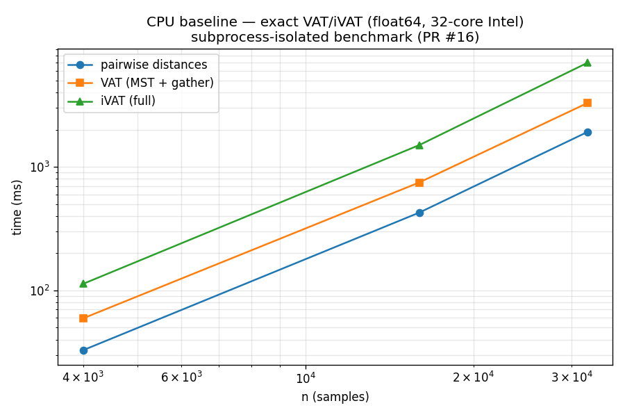
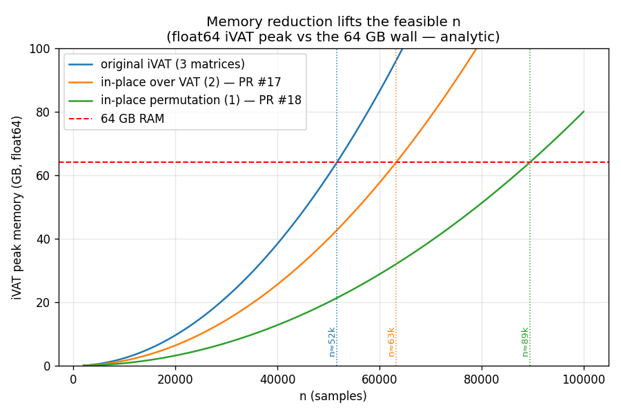
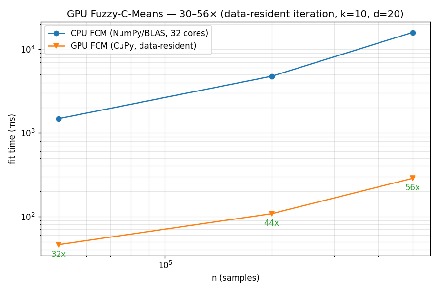
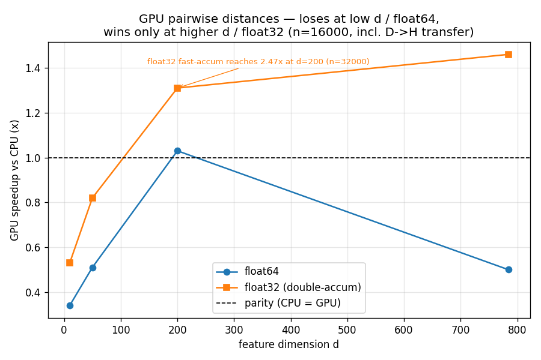
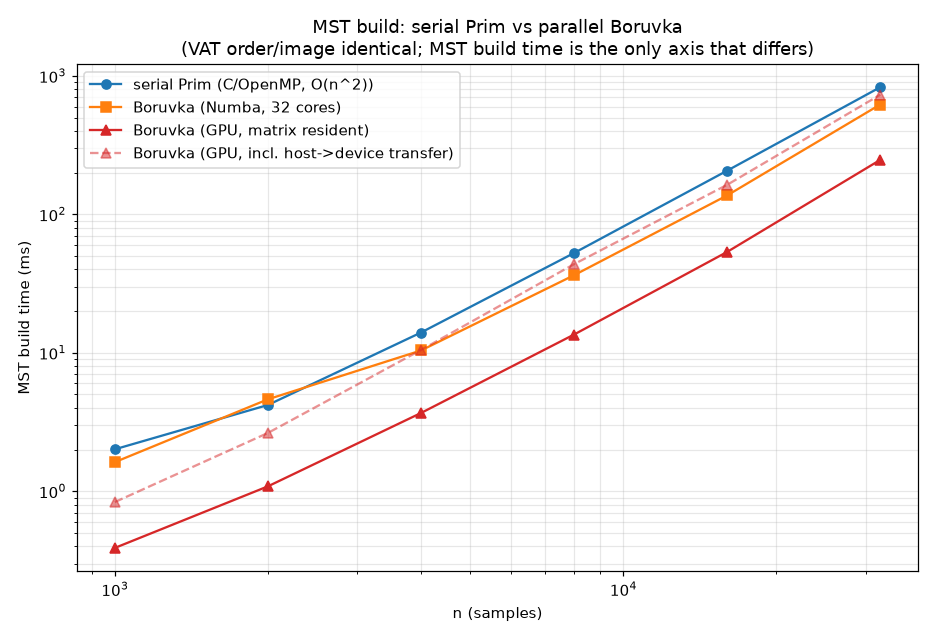

# Consolidated Performance Report — tribble-clustering (VAT/iVAT + FCM)

**Author:** Scott Phillips **· Date:** 2026-07-11
**Machine:** 32-core Intel, 64 GB RAM, NVIDIA RTX 4080 Laptop (12 GB, consumer —
FP64 ≈ 1/64 FP32). Windows, MSVC/AVX2, CuPy (CUDA 12).

Every comparison and figure that was previously split across PRs #16–#25, in one
place. All numbers are from clean-condition runs (see each source); figures under
`experiments/figures/`. Results marked **exact** are bit-identical to the serial
reference. Scientific interpretation (adversarial validity, prior art, limits) is
in `white-paper.md`; per-experiment detail is in the `experiments/findings/*_FINDINGS.md`.

---

## 1. CPU baseline — the exact O(n²) pipeline

The reference: pairwise distances → VAT (compact-Prim MST + gather) → iVAT
(minimax recurrence), all exact, float64, on 32 cores (subprocess-isolated
benchmark, PR #16).

All three stages are O(n²); iVAT construction dominates and is serial. This is
what the rest of the work speeds up or shrinks.

---

## 2. Memory — the dominant scaling wall (exact)

iVAT originally held **3** simultaneous n×n matrices; two in-place transforms
reduce this to **1**, which is what lifts the feasible problem size on a 64 GB
box. Analytic peak (float64) vs the 64 GB wall:

| n (float64 iVAT) | 3 matrices (orig.) | 2 (PR #17) | 1 (PR #18) |
|---|---|---|---|
| 48000 | 55 GB — **infeasible** | 36.9 GB ✅ | 18.5 GB ✅ |
| 64000 | 98 GB — infeasible | 65.5 GB — infeasible | **32.85 GB ✅** |
| max n in 64 GB | ≈ 52k | ≈ 63k | **≈ 89k** |

`n=64000` float64 iVAT goes from impossible to a 33 GB / 25 s run. Exact
throughout; a latent in-place-permutation correctness bug was also fixed here.

---

## 3. GPU Fuzzy-C-Means — the clean GPU win (30–56×)

FCM is iterative and data-resident, so it amortizes transfer. `FuzzyCMeans(use_gpu="auto")`.

| n (k=10, d=20) | CPU | GPU | speedup |
|---|---|---|---|
| 50 000 | 1480 ms | 46 ms | **32×** |
| 200 000 | 4759 ms | 108 ms | **44×** |
| 500 000 | 15933 ms | 286 ms | **56×** |

Converges to the same fixed point as the CPU (centers ~1e-5, labels >99% identical).

---

## 4. GPU pairwise distances — honest regime (not a blanket win)

The n×n result must transfer back over PCIe, and consumer FP64 is weak, so the
GPU only wins at higher feature dimension and float32 (timings **include** the
device→host copy):

- Low d / float64 (VAT's common case): **GPU loses** — stays on CPU.
- float32, d ≳ 100: GPU wins (1.3× at d=200; **2.47×** with fast-accum at n=32000).

`pairwise_distances(backend="auto")` routes to GPU only where it wins (float32, d ≥ 64).

---

## 5. Exact GPU-Borůvka VAT — the exact-at-scale win

VAT order depends only on the MST, so an exact device-side Borůvka MST reproduces
bit-identical VAT ordering. Build time vs serial Prim (matrix device-resident):

| MST build, n | serial Prim | Numba Borůvka | **GPU Borůvka** | GPU speedup |
|---|---|---|---|---|
| 4000 | 16 ms | 11 ms | 4.0 ms | 4.0× |
| 8000 | 95 ms | 49 ms | 12.5 ms | **7.6×** |
| 16000 | 222 ms | 192 ms | 43 ms | 5.2× |
| 32000 | 902 ms | 896 ms | 181 ms | 5.0× |

Output is bit-identical (VAT order match 1.0). The GPU win **grows with n** (bandwidth
absorbs the O(n²log n) work) and only holds when the matrix is already resident —
so a **fully on-device front-end** (distances→MST→order) gives 4.8–6.6× end-to-end:

| on-device front-end, n | 4000 | 8000 | 16000 | 32000 |
|---|---|---|---|---|
| speedup vs CPU | 4.8× | 5.3× | 6.1× | **6.6×** |

(CPU Numba Borůvka ≈ serial Prim: its log-factor cancels the parallelism on 32 cores.)

---

## 6. Divide-and-conquer VAT — the naive ↔ Borůvka spectrum (scale × partition)

Partition into N blocks, VAT each, merge. Ideal-parallel speedup grows ≈ N²…

…but naive quality collapses as N grows, while the structure-aware **stitch**
stays ≈ exact across the whole grid (this is the speed↔accuracy tradeoff):

MST-build spectrum — naive (fast/approx) ↔ Borůvka (exact/parallel):

---

## 7. Summary table

| Contribution | Metric | Result | Exact? | Source |
|---|---|---|---|---|
| In-place iVAT (3→1 matrices) | max n at 64 GB | 52k → **89k**; n=64k f64 now runs | ✅ | PR #17/#18 |
| GPU FCM | fit speedup | **30–56×** (n=50k–500k) | ~ (same fixed point) | PR #20 |
| GPU pairwise distances | speedup | 1.3–2.5× (high-d f32); **<1** low-d/f64 | ✅ | PR #19 |
| GPU Borůvka MST | MST-build speedup | **~5×**, grows with n | ✅ (bit-identical) | PR #22 |
| On-device VAT front-end | distances+MST+order | **4.8–6.6×** | ✅ | PR #23 |
| Naive block-decomposition | ideal-parallel speedup | up to **~800×** (N=32) | ✗ (approx) | PR #25 |
| Principled stitch (fps+top-m) | robustness | ARI 1.0 across partition×N; O(N²r²) | ≈ exact SL | PR #25 |

---

## 8. Caveats (state these to a reviewer)

- **Divide-and-conquer speedups are *ideal-parallel*** (largest block; blocks are
  independent) — not measured concurrent wall-clock.
- **GPU results are hardware-specific.** Consumer FP64 is weak; a datacenter GPU
  would shift the pairwise/Borůvka numbers upward.
- **Single machine, synthetic (mostly blob/2-D) data** for timing; and the
  divide-and-conquer *approximation* is only valid within single-linkage's regime
  (see `white-paper.md` §3–4 for the adversarial validation and boundaries).
- **Memory wins are constant-factor** (3×), not a change of asymptotic order.

Quality/robustness evidence (why the approximation is trustworthy, and where it
is not) is summarized in the two cross-cutting figures
`experiments/figures/adversarial_eval.png` and
`experiments/figures/principled_stitch_two_moons.png`, detailed in `white-paper.md`.
