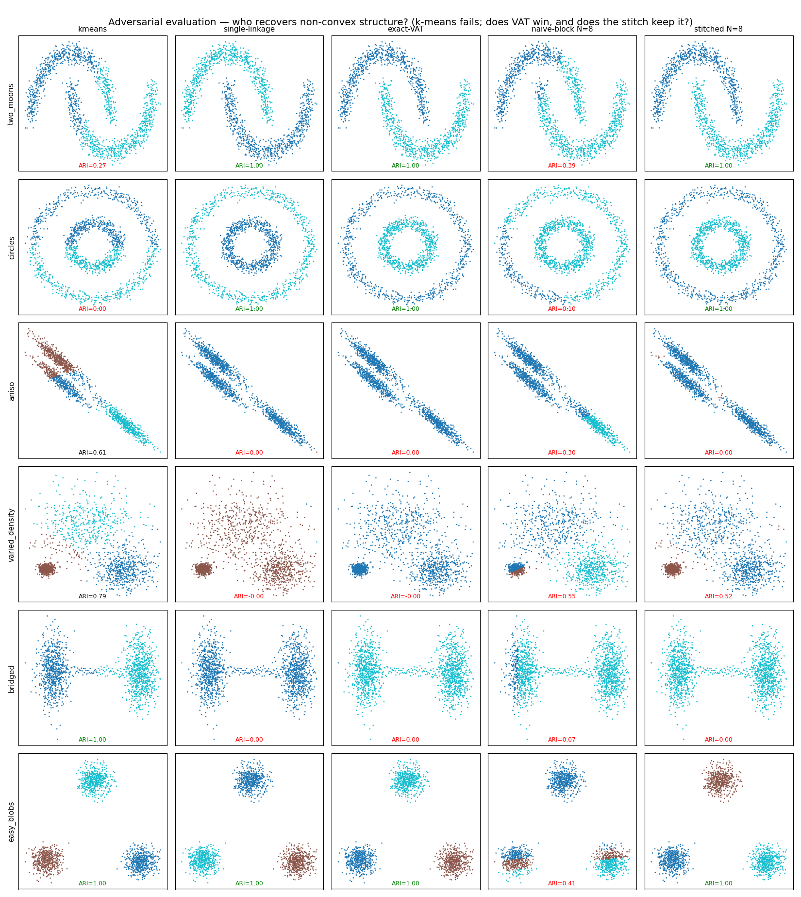
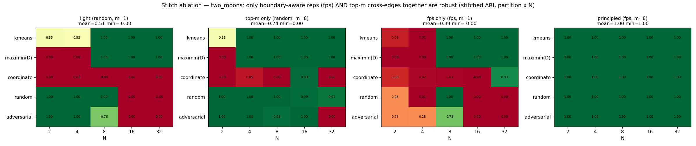

# Exact and Divide-and-Conquer VAT/iVAT at Scale — Preliminary Results

**Author:** Scott Phillips
**Date:** 2026-07-11
**Status:** *Preliminary results for committee review — not a finished paper.*
Numbers are from a single workstation (32-core Intel, 64 GB RAM, RTX 4080 Laptop
12 GB); all experiments are reproducible under `experiments/` and `benchmarks/`.
Full prior-art positioning is in `docs/novelty-review.md` / `docs/bibliography.md`.

---

## Abstract

VAT/iVAT (Visual Assessment of cluster Tendency) reorders a pairwise
dissimilarity matrix via an MST traversal so that clusters appear as dark
diagonal blocks. This note reports two threads of work. **(1) A systems thread**
that makes *exact* iVAT dramatically more memory- and compute-efficient at scale
(a 3× peak-memory reduction that lifts the feasible problem size, a 30–56×
GPU Fuzzy-C-Means front-end, and an exact GPU-Borůvka VAT ordering that is ~5×
faster than serial Prim). **(2) A methods thread** that investigates
divide-and-conquer VAT — partitioning the dissimilarity matrix, solving
sub-blocks in parallel, and merging. We show, on adversarial (non-convex,
non-metric) data and against the appropriate controls, that the machinery is
genuinely single-linkage-preserving — recovering structure k-means cannot — and
we characterize exactly where it holds and where it fails. The central
observation that unifies both threads: **VAT's output depends only on the MST,
not on how the MST is built**, which reduces "fast/parallel/approximate VAT" to
"fast/parallel/approximate MST."

---

## 1. Scope and the organizing observation

VAT (Bezdek & Hathaway, 2002) reorders points by the order a modified Prim's
algorithm adds them to the MST; iVAT (Havens & Bezdek, 2012) applies the exact
O(n²) minimax recurrence. Because Prim only ever traverses MST edges, **the VAT
ordering is a function of the MST alone** — any MST builder (serial Prim,
parallel Borůvka, GPU), followed by an O(n log n) tree traversal from the
max-dissimilarity seed, reproduces the *bit-identical* VAT ordering. Equivalently
(Gower & Ross, 1969), cutting the ordered iVAT profile is single-linkage
clustering. This is the lens for everything below.

---

## 2. Systems thread — exact iVAT, cheaper and faster

All results below are **exact** (bit-identical output to the reference serial
engine) unless noted.

| Contribution | Result | Note |
|---|---|---|
| In-place iVAT construction + permutation | IVAT peak memory **3 matrices → 1** | `n=64000` float64 iVAT: from *infeasible in 64 GB* (needed 98 GB) to **32.85 GB** |
| GPU Fuzzy-C-Means (data-resident) | **30–56×** vs 32-core CPU at n = 50k–500k | bit-comparable fixed point; a deterministic seed for FCM |
| GPU Borůvka MST (device-resident matrix) | **~5×** vs serial Prim at n = 32000, and the lead *grows* with n | exact; the O(n² log n) work is absorbed by GPU bandwidth |
| On-device VAT front-end (distances→MST→order) | **4.8–6.6×** end-to-end, growing with n | matrix never leaves the GPU |

A methodological byproduct worth flagging: the previously shipped *in-place*
permutation was **silently incorrect** (it coupled a cell and its mirror during
cycle-following); existing tests missed it because they only checked
permutation-invariant quantities. It is fixed and now verified bit-identical to
an independent reference.

**Honest boundary.** On this consumer GPU, float64 pairwise *distances* do **not**
beat 32 CPU cores (weak FP64 + PCIe transfer of the O(n²) result); the GPU wins
are FCM (data-resident, iterative) and the on-device MST/ordering, not the
one-shot distance matrix. The memory win is a constant factor (3×), not a change
of order.

---

## 3. Methods thread — divide-and-conquer VAT

### 3.1 The spectrum

Partition n points into N blocks, VAT each block's within-block sub-matrix, and
merge. Sub-VAT is O((n/N)²), so the work drops ~N× and blocks are embarrassingly
parallel (ideal-parallel speedup ≈ N²). The endpoints of the design space:

- **naive** (concatenate block orders) — fast but approximate;
- **stitched** (join blocks with a light cross-block edge set) — the middle;
- **Borůvka** (all cross-block edges) — exact.

Naive block-decomposition is fast (≈ N², up to ~800× ideal-parallel at N=32) but
its **cluster quality collapses as N grows** — each block boundary manufactures a
"pseudo-cluster" (the seam artifact; the same phenomenon NASA calls a
"processing-window artifact"). Quality is entirely partition-dependent.

### 3.2 The decisive test: does it beat k-means, or *is* it k-means?

Blobs are the wrong data to argue for VAT (k-means already solves them). On
adversarial data with the missing controls (k-means alone, exact single-linkage):

| dataset | k-means | single-linkage | exact-VAT | naive-block | **stitched** |
|---|---|---|---|---|---|
| two_moons | 0.27 | 1.00 | 1.00 | 0.39 | **1.00** |
| circles | 0.00 | 1.00 | 1.00 | 0.10 | **1.00** |
| aniso | 0.61 | 0.00 | 0.00 | 0.30 | 0.00 |
| bridged | **1.00** | 0.00 | 0.00 | 0.07 | 0.00 |

*(Adjusted Rand Index vs ground truth.)* On non-convex data k-means fails while
exact-VAT and the stitched decomposition recover the true clustering (= single-
linkage). The k-means partition *cuts through* the moons/rings, yet the stitch
reconnects across the cuts — so the method is **not** its k-means partition in
disguise. Naive concatenation fails there, so the stitch does real work.
Symmetrically, VAT/stitched **faithfully inherit single-linkage's failures**
(aniso, bridged) — it is a true VAT approximation, better exactly where single-
linkage is and worse where it chains.

### 3.3 Robustness: a principled bounded stitch

The naive light stitch (random representatives, one cross-edge per block pair) is
*fragile* on non-convex data (ARI swings 0↔1 with partition and N). An ablation
shows the fix requires two ingredients **together** — boundary-aware
representatives (farthest-point) **and** top-m cross-edges per block pair:

| stitch variant (two-moons, over partition × N grid) | mean ARI | min | frac ≥ 0.9 |
|---|---|---|---|
| light (random, m=1) | 0.51 | 0.00 | 0.44 |
| top-m only (random, m=8) | 0.74 | 0.00 | 0.72 |
| fps only (fps, m=1) | 0.39 | 0.00 | 0.32 |
| **principled (fps + top-m=8)** | **1.00** | **1.00** | **1.00** |

The principled stitch is ARI = 1.00 across *every* partition — including random
and adversarial partitions that slice through the clusters — at **bounded
O(N²r²)** cost (it does not collapse to the O(n²) exact merge). On circles it
reaches mean 0.96 (one failing configuration — near-total, not absolute).

### 3.4 Arbitrary / non-metric dissimilarity (the niche), and auto-k

VAT consumes a dissimilarity matrix, not coordinates — so it and the
coordinate-free stitch apply where k-means / kd-tree-EMST cannot. The stitch
preserves **exact single-linkage** on genuinely non-metric inputs (fractional
p=0.5 Minkowski, which violates the triangle inequality 14% of the time;
cosine; kNN-geodesic) — agreement 1.0 with exact VAT in every case. For choosing
k without supervision, both the max-gap rule and a silhouette-on-D sweep recover
the true k and ARI = 1.0 **exactly where single-linkage is valid** (including
non-convex), and neither recovers k where VAT itself fails — auto-k is bounded by
the validity of the dendrogram, not by the k-picker.

---

## 4. Positioning and honest limits

- **Not "the first fast/GPU VAT."** eVAT (Meng & Yuan, 2018) already gives an
  exact GPU VAT/iVAT. The prior-art-distinct contribution is the combination:
  *exact, parallel, on an arbitrary (non-metric) dense dissimilarity matrix, with
  a characterized divide-and-conquer approximation spectrum.* The parallel /
  priority-queue MST framing is the author's own prior work (NAFIPS 2025/2026;
  `pvat`/`pqvat`), not external prior art.
- **Divide-and-conquer with cross-edge merge is classical** (DiSC, SHRINK/PINK,
  distance-decomposition EMST); the block-VAT recipe is a naive instance and the
  seam artifact is a known window artifact. The novelty is the VAT-specific
  characterization, the boundary-aware + top-m bounded stitch that makes the
  cheap approximation robust, and the arbitrary-dissimilarity regime.
- **Everything inherits single-linkage's regime.** The method wins on non-convex,
  arbitrary-dissimilarity data and loses on bridged / anisotropic-touching data —
  faithfully. This is a bound to state up front, not to hide.
- **Speed caveats.** Divide-and-conquer speedups are *ideal-parallel* (largest
  block); the systems GPU wins are hardware-specific (consumer FP64 is weak).

---

## 5. The defensible claim (and what the real paper must add)

> **A parallel, bounded-cost, partition-robust, auto-k divide-and-conquer engine
> for VAT/iVAT that operates on arbitrary — including non-metric — dissimilarity
> matrices, preserving the single-linkage structure that centroid methods cannot
> represent, and whose error is confined to where single-linkage itself is
> unreliable. It is anchored by an exact GPU-Borůvka realization (bit-identical
> to serial VAT) and an in-place engine that lifts the feasible problem size.**

For the full paper: (i) larger-scale and higher-dimensional datasets and a
head-to-head against eVAT and clusiVAT; (ii) real non-metric domains (DTW,
edit/graph distances) rather than synthetic non-metric norms; (iii) a datacenter
GPU (full-rate FP64) to separate the algorithm from this card's FP64 penalty;
(iv) a theoretical bound on the stitch's approximation error as a function of
(partition, representatives r, top-m); (v) an end-to-end on-device iVAT recurrence
so the full pipeline — not just the ordering — stays on the GPU.

---

## Key references
Full list with links in `docs/bibliography.md`.

- Bezdek & Hathaway, "VAT," *IJCNN* 2002.
- Havens & Bezdek, "An Efficient Formulation of iVAT," *IEEE TKDE* 2012.
- Gower & Ross, "Minimum Spanning Trees and Single Linkage Cluster Analysis,"
  *JRSS-C* 1969.
- Meng & Yuan, "Parallel edge-based VAT on GPU (eVAT)," *Int. J. Data Science and
  Analytics* 2018. doi:10.1007/s41060-018-0100-7
- Kumar et al., "A Hybrid Approach to Clustering in Big Data (clusiVAT),"
  *IEEE T-Cybernetics* 2016.
- Vineet et al., "Fast Minimum Spanning Tree for Large Graphs on the GPU,"
  *HPG* 2009.
- Jin et al., "DiSC: Distributed Single-linkage Hierarchical Clustering using
  MapReduce."
